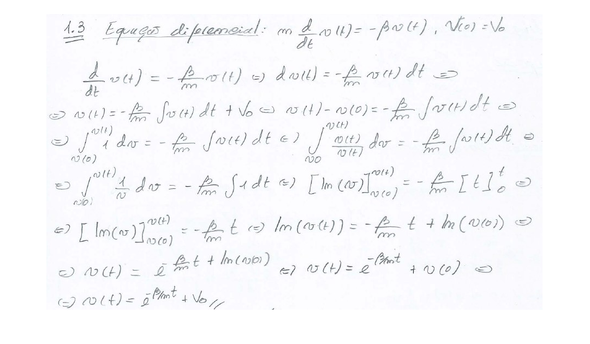
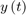
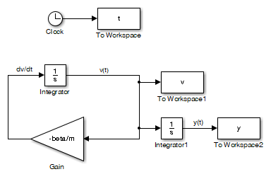
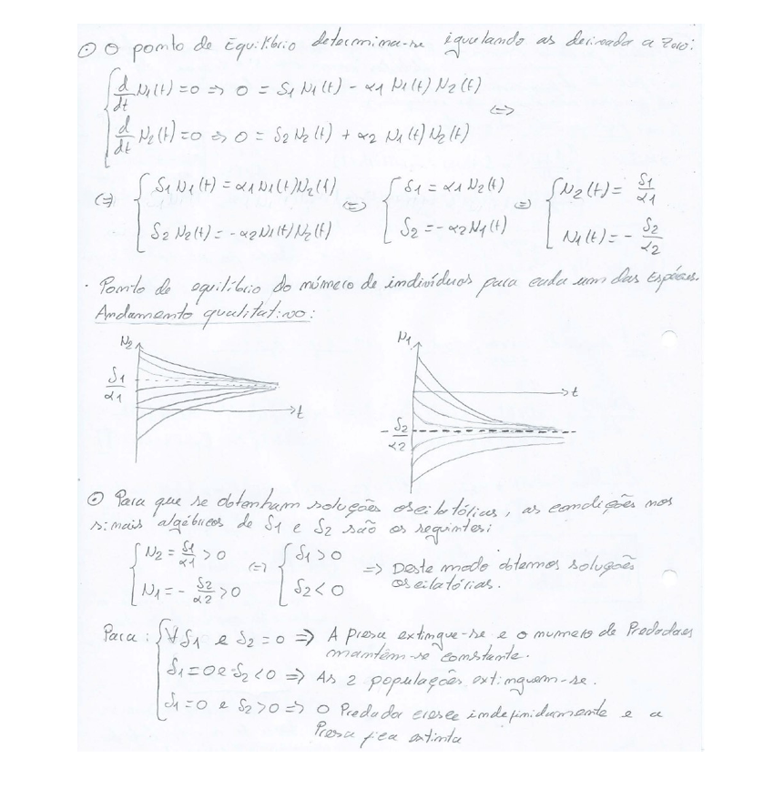
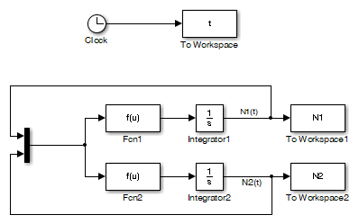
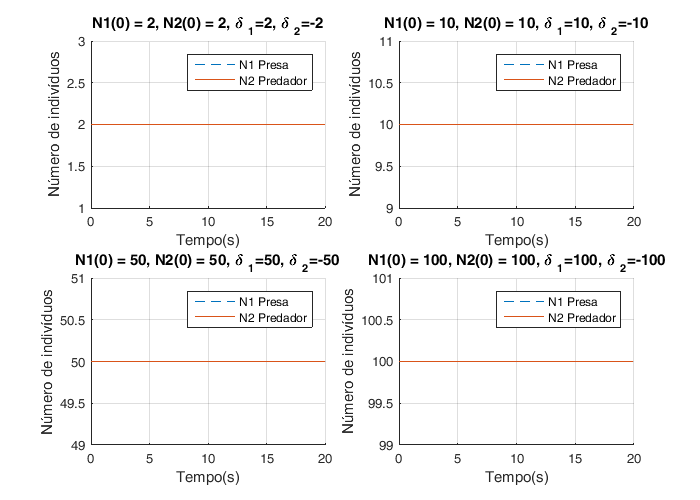
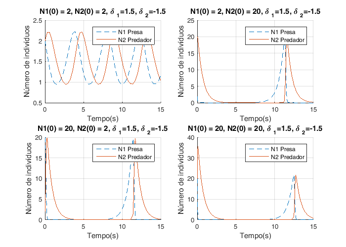
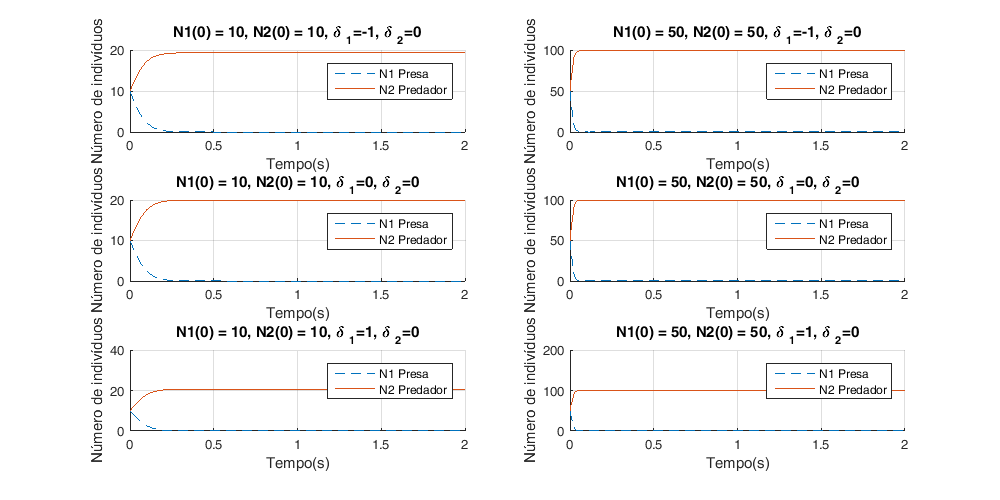
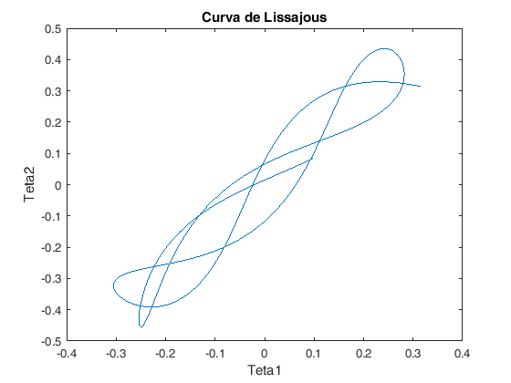

::: {.content}
Trabalho de Laboratório - Simulação Básica em Matlab/Simulink
=============================================================

``` {.language-matlab}
Autor:  Diogo Vilar Sardinha
```

Contents
--------

<div>

-   [Questão 1.1 - Modelo para simulação do movimento livre de uma
    viatura](#1)
-   [Questão 1.2 - Evolução qualitativa da velocidade no tempo](#2)
-   [Questão 1.3 - Equação diferencial](#3)
-   [Questão 1.4 - Equação diferencial que rege a posição do
    veículo](#4)
-   [Questão 1.5 - Simulação do movimento livre de uma viatura](#5)
-   [Questão 2.1 Modelo Predador-Presa](#9)
-   [Questões 2.2 e 2.3 - Simulações do Modelo Predador-Presa](#10)
-   [Questões 2.2 e 2.3 - Soluções de Equilíbrio](#13)
-   [Questões 2.2 e 2.3 - Soluções Oscilatórias](#14)
-   [Questões 2.2 e 2.3 - Soluções em que a Presa se extingue e o
    Predador mantem-se constante](#17)
-   [Questões 2.2 e 2.3 - Soluções em que a Presa e o Predador se
    extinguem](#18)
-   [Questões 2.2 e 2.3 - Soluções em que a Presa se extingue e o
    Predador cresce indefinidamente](#20)
-   [Questões 2.2 e 2.3 - Gráfico do espaço de fases N1 e N2 para
    direntes valores de N01 e N02](#22)
-   [Questão 2.4.a) Aproximação por tentativa e erro](#23)
-   [Questão 2.4.b) Ajuste de parametros por estimação do erro
    absoluto](#26)
-   [Questão 2.4.c) Obtenção dos parametros por calculo exacto do erro
    mínimo](#31)
-   [Questão 2.4.d) Validação do modelo por obtenção do erro
    mínimo](#36)
-   [Questão 3.1 Sistema Caótico](#39)
-   [Questão 3.2 Curva de Lissajous](#40)
-   [Questão 3.3 Soluções posíveis](#43)
-   [Questão 3.4 - Determinação do tempo que decorre até uma das barras
    "fazer um looping"%%](#44)

</div>

Questão 1.1 - Modelo para simulação do movimento livre de uma viatura[]{#1}
---------------------------------------------------------------------------

``` {.codeinput}
n=1; % inicialização do contador para as figuras
figure(n)
n=n+1;I = imread('./figures/1.1.jpg');
imshow(I);
```


Questão 1.2 - Evolução qualitativa da velocidade no tempo[]{#2}
---------------------------------------------------------------

``` {.codeinput}
figure(n)
n=n+1;
I = imread('./figures/1.2.jpg');
imshow(I);
```


Questão 1.3 - Equação diferencial[]{#3}
---------------------------------------

``` {.codeinput}
figure(n)
n=n+1;
I = imread('./figures/1.3.jpg');
imshow(I);
```



Questão 1.4 - Equação diferencial que rege a posição do veículo[]{#4}
---------------------------------------------------------------------

``` {.codeinput}
figure(n)
n=n+1;
I = imread('./figures/1.4.jpg');
imshow(I);
close all;
```

Questão 1.5 - Simulação do movimento livre de uma viatura[]{#5}
---------------------------------------------------------------

A equação diferencial  mais o cálculo da
posição  são
representados pelo seguinte diagrama de Blocos no Simulink:

``` {.codeinput}
open_system('viatura')
```

Simulação de um movimento livre de uma viatura para diferentes valores
de m, beta e V0

``` {.codeinput}
y0=5;
v0=0;
beta=5;
m=0;
```

Gráficos de posição

``` {.codeinput}
figure(n)
n=n+1;
hold all;
for m=[30 60 3]
    for v0=[3 -3]
        sim('viatura', 25)
        plot(t, y, 'DisplayName', ['m/beta=',num2str(m/beta),'s; v0=',num2str(v0),'m/s'])
    end
end
legend('show')
title('Curvas da Posição do Veículo')
ylabel('Posição')
xlabel('Tempo(s)')
grid on
```


Gráficos de Velocidade

``` {.codeinput}
figure(n)
n=n+1;
hold all;
for m=[30 60 3]
    for v0=[3 -3]
        sim('viatura', 25)
        plot(t,v, 'DisplayName', ['m/beta=',num2str(m/beta),'s; v0=',num2str(v0),'m/s'])
    end
end
legend('show')
title('Curvas da Velocidade do Veículo')
ylabel('Velocidade')
xlabel('Tempo(s)')
grid on
```



Questão 2.1 Modelo Predador-Presa[]{#9}
---------------------------------------

``` {.codeinput}
figure(n)
n=n+1;
I = imread('./figures/2.1.1.jpg');
J = imresize(I, 0.7);
imshow(J);
figure(n)
n=n+1;
I = imread('./figures/2.1.2.jpg');
J = imresize(I, 0.7);
imshow(J);
```

 

Questões 2.2 e 2.3 - Simulações do Modelo Predador-Presa[]{#10}
---------------------------------------------------------------

O sistema de equações: 


 é representado pelo
seguinte diagrama Simulink:

``` {.codeinput}
open_system('predador_presa')
```

Considerando alpha1=alpha2=1, simula-se o sistema descrito pelo diagrama
para diferentes valores das condições iniciais: N1(0), N2(0), delta 1 e
delta 2:

``` {.codeinput}
alpha1=1;
alpha2=1;
```

Questões 2.2 e 2.3 - Soluções de Equilíbrio[]{#13}
--------------------------------------------------

Neste caso constata-se que o numero de individuos de cada uma das
populações mantem-se constante atravês da verificação das seguintes
condiço\~es: 

``` {.codeinput}
figure(n)
fig = figure(n);
set(fig, 'Position', [0, 0, 700, 500])  % x, y, largura e comprimento da figura
n=n+1;
hold all;
N10_aux=[2 10 50 100];
N20_aux=[2 10 50 100];
delta1_aux=[2 10 50 100];
delta2_aux=[-2 -10 -50 -100];
for k=1:4
    N10 = N10_aux(k);
    N20 = N20_aux(k);
    delta1 = delta1_aux(k);
    delta2 = delta2_aux(k);
    sim('predador_presa',20)
    subplot(2,2,k)
    hold all;
    plot(t, N1,'--','DisplayName', 'N1 Presa')
    plot(t, N2, 'DisplayName', 'N2 Predador')
    title(['N1(0) = ',num2str(N10),', N2(0) = ',num2str(N20),', {\delta }_{1}=',num2str(delta1),', {\delta }_{2}=',num2str(delta2)])
    ylabel('Número de indivíduos')
    xlabel('Tempo(s)')
    grid on
    legend('show')
end
```


Questões 2.2 e 2.3 - Soluções Oscilatórias[]{#14}
-------------------------------------------------

As soluções oscilatórias verificam-se caso:
 
 Para além disto:


Soluções para delta1 = 1.5 e delta2 = -1.5

``` {.codeinput}
figure(n)
fig = figure(n);
set(fig, 'Position', [0, 0, 700, 500])  % x, y, largura e comprimento da figura
n=n+1;
hold all;
delta1=1.5;
delta2=-1.5;
k=1;
for N10=[2 20]
    for N20=[2 20]
        sim('predador_presa', 15)
        subplot(2,2,k)
        hold all;
        k=k+1;
        plot(t, N1,'--','DisplayName', 'N1 Presa')
        plot(t, N2, 'DisplayName', 'N2 Predador')
        title(['N1(0) = ',num2str(N10),', N2(0) = ',num2str(N20),', {\delta }_{1}=',num2str(delta1),', {\delta }_{2}=',num2str(delta2)])
        ylabel('Número de indivíduos')
        xlabel('Tempo(s)')
        grid on
        legend('show')
    end
end
```



Soluções para delta1 = 3.5 e delta2 = -2.5

``` {.codeinput}
figure(n)
fig = figure(n);
set(fig, 'Position', [0, 0, 700, 500])  % x, y, largura e comprimento da figura
n=n+1;
hold all;
delta1=3.5;
delta2=-2.5;
k=1;
for N10=[2 20]
    for N20=[2 20]
        sim('predador_presa', 15)
        subplot(2,2,k)
        hold all;
        k=k+1;
        plot(t, N1,'--','DisplayName', 'N1 Presa')
        plot(t, N2, 'DisplayName', 'N2 Predador')
        title(['N1(0) = ',num2str(N10),', N2(0) = ',num2str(N20),', {\delta }_{1}=',num2str(delta1),', {\delta }_{2}=',num2str(delta2)])
        ylabel('Número de indivíduos')
        xlabel('Tempo(s)')
        grid on
        legend('show')
    end
end
```



Questões 2.2 e 2.3 - Soluções em que a Presa se extingue e o Predador mantem-se constante[]{#17}
------------------------------------------------------------------------------------------------

Dois conjuntos de condições iniciais que conduzem a evoluções identicas
do sistema. 

``` {.codeinput}
figure(n)
fig = figure(n);
set(fig, 'Position', [0, 0, 1000, 500])  % x, y, largura e comprimento da figura
n=n+1;
hold all;
N10_aux=[10 50 10 50 10 50];
N20_aux=[10 50 10 50 10 50];
delta1_aux=[-1 -1 0 0 1 1];
delta2=0;
tsim=2;
for k=1:6
    N10 = N10_aux(k);
    N20 = N20_aux(k);
    delta1 = delta1_aux(k);
    sim('predador_presa')
    subplot(3,2,k)
    hold all;
    plot(t, N1,'--','DisplayName', 'N1 Presa')
    plot(t, N2, 'DisplayName', 'N2 Predador')
    title(['N1(0) = ',num2str(N10),', N2(0) = ',num2str(N20),', {\delta }_{1}=',num2str(delta1),', {\delta }_{2}=',num2str(delta2)])
    ylabel('Número de indivíduos')
    xlabel('Tempo(s)')
    grid on
    legend('show')
end
```



Questões 2.2 e 2.3 - Soluções em que a Presa e o Predador se extinguem[]{#18}
-----------------------------------------------------------------------------


Soluções para delta1 = 3.5 e delta2 = -2.5

``` {.codeinput}
figure(n)
fig = figure(n);
set(fig, 'Position', [0, 0, 700, 500])  % x, y, largura e comprimento da figura
n=n+1;
hold all;
delta1=0;
delta2=-1.5;
k=1;
for N10=[2 20]
    for N20=[2 20]
        sim('predador_presa',30)
        subplot(2,2,k)
        hold all;
        k=k+1;
        plot(t, N1,'--','DisplayName', 'N1 Presa')
        plot(t, N2, 'DisplayName', 'N2 Predador')
        title(['N1(0) = ',num2str(N10),', N2(0) = ',num2str(N20),', {\delta }_{1}=',num2str(delta1),', {\delta }_{2}=',num2str(delta2)])
        ylabel('Número de indivíduos')
        xlabel('Tempo(s)')
        grid on
        legend('show')
    end
end
```



Questões 2.2 e 2.3 - Soluções em que a Presa se extingue e o Predador cresce indefinidamente[]{#20}
---------------------------------------------------------------------------------------------------


Soluções para delta1 = 3.5 e delta2 = -2.5

``` {.codeinput}
figure(n)
fig = figure(n);
set(fig, 'Position', [0, 0, 700, 500])  % x, y, largura e comprimento da figura
n=n+1;
hold all;
delta1=0;
delta2=1;
k=1;
tsim=0.5;
for N10=[2 20]
    for N20=[2 20]
        sim('predador_presa')
        subplot(2,2,k)
        hold all;
        k=k+1;
        plot(t, N1,'--','DisplayName', 'N1 Presa')
        plot(t, N2, 'DisplayName', 'N2 Predador')
        title(['N1(0) = ',num2str(N10),', N2(0) = ',num2str(N20),', {\delta }_{1}=',num2str(delta1),', {\delta }_{2}=',num2str(delta2)])
        ylabel('Número de indivíduos')
        xlabel('Tempo(s)')
        grid on
        legend('show')
    end
end
```


Questões 2.2 e 2.3 - Gráfico do espaço de fases N1 e N2 para direntes valores de N01 e N02[]{#22}
-------------------------------------------------------------------------------------------------

``` {.codeinput}
delta1 =5;
delta2 =-5;
tsim = 5;
figure(n)
n=n+1;
hold all;
for N10 =  [20 2]
   for N20 = [15 4]
        sim('predador_presa');
        factor=N10/N20;
        plot(N1, N2,'DisplayName',['N1(0)/N2(0) = ', num2str(factor)])
   end
end
xlabel('Número de Presas (N1)')
ylabel('Número de Predadores (N2)')
title('Gráfico em espaço de fase (N1,N2)')
legend('show')
```



Questão 2.4.a) Aproximação por tentativa e erro[]{#23}
------------------------------------------------------

Simulando o sistema para diferentes valores das características N2(0) e
 dos predadores,
obteve-se, por tentativa e erro, uma evoluçõão temporal do número de
presas aproximada à curva fornecida.

``` {.codeinput}
load('presas.mat')
% carregamento do ficheiro presas.mat que contem valores para uma populacao
% de presas ao longo do tempo
delta1=3.1;
alpha1=1.4;
delta2=-1.5;
N10=4;
figure(n)
fig = figure(n);
set(fig, 'Position', [0, 0, 700, 500])  % x, y, largura e comprimento da figura
n=n+1;
hold all;
alpha2_aux=[0.7  0.7];
N20_aux=[1.6 1.6];
hold all;
plot(tr, yr, 'DisplayName', 'Presas(N1) (dados)')
for k=1:1
    N20 = N20_aux(k);
    alpha2 = alpha2_aux(k);
    sim('predador_presa',tr)
    plot(tr, N1,'--','DisplayName',['Presas(N1) (simulação), {\alpha }_{2}=',num2str(alpha2),', N2(0) = ',num2str(N20)])
end
XMIN=0; XMAX=20; YMIN=0; YMAX=6;
axis ([XMIN XMAX YMIN YMAX]);
legend('show')
title('Aproximação dos dados recolhidos por simulação')
ylabel('Número de indivíduos N1(t) ')
xlabel('Tempo(s)')
grid on
```


foi obtida por tentativa e erro a Seguinte aproximação:

N2(0)= 1.6 e = 0.7

Questão 2.4.b) Ajuste de parametros por estimação do erro absoluto[]{#26}
-------------------------------------------------------------------------

De forma a obter uma estimativa dos valores de N2(0) e
 da população de
predadores começa-se por fazer um varrimento de possíveis valores destes
parâmetros e, para cada par de valores, estimar o erro absoluto ou soma
dos valores absolutos das diferenças entre os valores fornecidos e os
calculados. Os valores são escolhidos tendo em conta que, na alínea
anterior, foi obtida uma aproximação aos valores de N2(0) e
 por tentativa e
erro. Na alínea anterior foram obtidos dois pares de valores: N2(0)= 1.6
e =0.7

``` {.codeinput}
p=15; % numero de valores de N0 e alpha a testar
erros = zeros(p, p); % icialização da matriz com os valores de erro
N20_min=1.4;
N20_max=1.8;
alpha2_min=0.5;
alpha2_max=0.9;
```

Pelas aproximacoes feitas na alinea 2.4a) sabemos que valores de
 e N2(0) estão
dentro destes parametros, e os intervalos foram escolhidos de modo a
haver coerencia entre os dados fornecidos pelo ficheiro presas.mat

``` {.codeinput}
N20_aux=linspace(N20_min,N20_max,p);
% N2(0) -> espaço linear, vector de p pontos entre N20_min e N20_max
alpha2_aux=linspace(alpha2_min,alpha2_max,p);
% alpha2 -> espaço linear, vector de p pontos entre alpha2_min e alpha2_max

h = waitbar(0, 'A calcular erros... Está quase...');
set(h,'HandleVisibility','off')
for i=1:p
    for j=1:p
        alpha2 = alpha2_aux(i);
        N20 = N20_aux(j);
        % erros(i,j)=erro([N20_aux(j) alpha2_aux(i)]);
        erros(i,j)=erro([N20 alpha2]);
    end
    delete(h);
    h = waitbar(i/p, 'A calcular erros... Está quase...');
    % barra de loading a apresentar durante simulação
end
delete(h);

figure(n)
fig = figure(n);
set(fig, 'Position', [0, 0, 700, 500])  % x, y, largura e comprimento da figura
n=n+1;
subplot(2,1,1)
surfc(alpha2_aux,N20_aux,erros);
xlabel('{\alpha }_{2}'); ylabel('N2(0)'); zlabel('Erro'); colorbar;
title('Superfície de Erro')
subplot(2,1,2)
contour(alpha2_aux,N20_aux,erros,100);% 100 linhas de contorno
xlabel('{\alpha }_{2}'); ylabel('N2(0)'); colorbar;
title('Curvas de nível')
```


Os valores de  e
N2(0) não são facilmente estimados pela observação dos gráficos
anteriores, sendo apenas possível estimar um intervalo de valores. A
precisão da estimação depende do número (p) de valores a testar e do
intervalo entre o valor mínimo e o máximo. Os intervalos de valores para
 e N2(0) foram
escolhidos obsevando a surferficie de erro obtida vista de cima e
analisando dentro da curva mais estreita do grafico contour, obtendo-se:

N2(0)= \[1.586 , 1.614\] e
 = \[0.614 ,
0.74\]

Com base neste intervalaos vamos estimar de novo intervalos de valores
mais precisos

``` {.codeinput}
N20_min=1.586;
N20_max=1.614;
alpha2_min=0.674;
alpha2_max=0.74;
N20_aux=linspace(N20_min,N20_max,p);
alpha2_aux=linspace(alpha2_min,alpha2_max,p);

h = waitbar(0, 'A calcular erros... Está quase...');
set(h,'HandleVisibility','off')
for i=1:p
    for j=1:p
        alpha2 = alpha2_aux(i);
        N20 = N20_aux(j);
        erros(i,j)=erro([N20 alpha2]);
    end
    delete(h);
    h = waitbar(i/p, 'A calcular erros... Está quase...');
end
delete(h);

figure(n)
fig = figure(n);
set(fig, 'Position', [0, 0, 700, 500])  % x, y, largura e comprimento da figura
n=n+1;
subplot(2,1,1)
surfc(alpha2_aux,N20_aux,erros);
xlabel('{\alpha }_{2}'); ylabel('N2(0)'); zlabel('Erro'); colorbar;
title('Superfície de Erro')
subplot(2,1,2)
contour(alpha2_aux,N20_aux,erros,100);% 100 linhas de contorno
xlabel('{\alpha }_{2}'); ylabel('N2(0)'); colorbar;
title('Curvas de nível')
```


Pelo que se conclui que o mínimo global é, aproximadamente:
 = 0.71 e
N2(0)=1.597

Questão 2.4.c) Obtenção dos parametros por calculo exacto do erro mínimo[]{#31}
-------------------------------------------------------------------------------

Utilizando um método de optimização, pretende-se calcular o mínimo erro
de forma mais eficientea que na alínea anterior. Recorrendo à função
fminsearch, que calcula o mínimo local, vamos obter os valores mínimos
de  e N02 partindo
dos valores obtidos na alínea anterior:
 = 0.71 e
N2(0)=1.597

``` {.codeinput}
optimo = fminsearch(@erro, [1.597 0.71]);
```

optimo contem o valor preciso de alpha2 e N2(0) que melhor optimizam a
evolucao temporal do modelo. Com esta função podemos obter um resultado
mais exacto do que na alinea anterior, caso os valores inicias dos pares
alpha2 e N2(0) forem o mais correctos. Se não forem bem escolhidos o
valor returnado será um mínimo local em vez de um mínimo absoluto da
função.

``` {.codeinput}
disp(strcat('N2(0)=',num2str(optimo(1))));
disp(strcat('alpha2=',num2str(optimo(2))));
```

``` {.codeoutput}
N2(0)=1.6042
alpha2=0.70033
```

Os resultados obtidos nesta alíena diferem quase nada dos ecolhidos dos
gráficos, sendo N02 = 1.6042 e
= 0.70033. Por
observação dos gráficos concluimos que este valores obtidos estes se
encontram na gama de valores das curvas de nível com menor erro. Se
forem dados valores inciais afastados das curvas de erro mínimo a função
retorna um valor muito diferente. Por exemplo, para N2(0)=10 e
=1 O mínimo local
obtido pela função fminsearch é:

``` {.codeinput}
optimo2 = fminsearch(@erro, [10 1]);
disp(strcat('N2(0)=',num2str(optimo2(1))));
disp(strcat('alpha2=',num2str(optimo2(2))));
```

``` {.codeoutput}
N2(0)=4.1239
alpha2=2.5442
```

Tal como esperado obtemos valores que não correspodem a uma boa
aproximação N02 = 4.1239 e
 = 2.5442

Questão 2.4.d) Validação do modelo por obtenção do erro mínimo[]{#36}
---------------------------------------------------------------------

Simulando o sistema de equações para os valores de erro mínimo, obtém-se
o seguinte gráfico:

``` {.codeinput}
alpha1=1.4;
delta1=3.1;
delta2=-1.5;
N10 = 4;
load('presas.mat')
alpha2 = optimo(2);
N20 = optimo(1);
sim('predador_presa', tr)

figure(n)
n=n+1;
plot(tr,N1,tr,yr,'o')
title('Simulação para valores de N2(0) e {\alpha }_{2} de erro mínimo')
xlabel('Tempo(s)')
ylabel('Número de Indívíduos N1(t)')
legend('Presa (simulação)', 'Presa (dados)')
grid on
```


Como podemos averiguar os valores dos parâmetros estimados N2(0) e
 permitem-nos
obter uma boa aproximação da curva proveniente dos dados. A solução do
sistema para os valores estimados inclui os pontos da curva fornecida
por simulação excepto os valores afectados pelo ruído.

Questão 3.1 Sistema Caótico[]{#39}
----------------------------------

Como estamos em repouso inicial, consideramos que t10\' = t20\' = 0,
sendo t10\' e t20´ as velocidades angulares iniciais de cada um dos
braços. Por conseguinte, obtemos p1 = p2 = 0.

``` {.codeinput}
open_system('pendulo')

p10 = 0;
p20 = 0;

% Simulação de teste com t10 = t10 = pi/10:
t10 = pi/10;
t20 = pi/10;

sim('pendulo', 15)
figure(n);
plot(t,t1,t,t2);
title('Simulação de Teste');
legend('Teta1','Teta2')

n=n+1;
```


Questão 3.2 Curva de Lissajous[]{#40}
-------------------------------------

Para obter uma figura que se parecesse com a curva de Lissajous, opta-se
por tomar t10 = t20 = pi/10.

``` {.codeinput}
sim('pendulo', 3)
figure(n);
plot(t1,t2);
title('Curva de Lissajous');
xlabel('Teta1');
ylabel('Teta2');

n=n+1;
```


Aumentando a amplitude da deflexão inicial do pêndulo obtemos:

``` {.codeinput}
for i = [pi/5 pi/2 3]

    t10 = i;
    t20 = i;

    sim('pendulo', 3)
    figure(n);
    plot(t1,t2);
    xlabel('Teta1');
    ylabel('Teta2');
    n = n+1;

end
```

  

Como podemos claramente verificar, á medida que aumentamos o Teta1 e
Teta2 iniciais, a figura fica cada vez mais irregular.

Questão 3.3 Soluções posíveis[]{#43}
------------------------------------

``` {.codeinput}
figure(n)
n=n+1;
I = imread('./figures/3.3.1.jpg');
J = imresize(I, 0.6);
imshow(J);
figure(n)
n=n+1;
I = imread('./figures/3.3.2.jpg');
J = imresize(I, 0.6);
imshow(J);
```

 

Questão 3.4 - Determinação do tempo que decorre até uma das barras "fazer um looping"%%[]{#44}
----------------------------------------------------------------------------------------------

``` {.codeinput}
m=1;
l=0.5;
```

``` {.codeinput}
%Começamos por criar 2 vectores x e y com as coordenadas x e y,
%respectivamente, da posição inicial da ponta do pêndulo
```

``` {.codeinput}
x0=[-0.5 0.01 -0.1 0.00001];
y0=[-0.5 0.01 0.5 0.9999];

j=1;

for i=1:length(x0)

    x=x0(i);
    y=y0(i);

    %Cálculo dos ângulos teta1 e teta2 iniciais
    %correspondentes as valores x e y inicias.
    teta10(i)=acos((((power(x,2)+power(y,2))/(2*x))*(y/x)+sqrt(power(y/x,2)*power(l,2)+power(l,2)-power((power(x,2)+power(y,2))/(2*x),2)))/((power(y/x,2)+1)*l));
    teta20(i)=acos((y-(((power(x,2)+power(y,2))/(2*x))*(y/x)+sqrt(power(y/x,2)*power(l,2)+power(l,2)-power((power(x,2)+power(y,2))/(2*x),2)))/((power(y/x,2)+1)))/l);

    %Cálculo do p1 e p2 correspondentes a cada um dos ângulos iniciais e para teta1'(0) = 0º/s e teta2'(0) = -30º/s
    p1_ref(i)=-10*m*power(l,2);
    p2_ref(i)=-15*m*power(l,2)*cos(teta10(i)-teta20(i));

    t10=teta10(i);
    t20=teta20(i);
    p1=p1_ref(i);
    p2=p2_ref(i);

    %Simulação do sistema:
    sim('pendulo', 250)
    figure(n);
    plot(t1,t2);
    xlabel('Teta1');
    ylabel('Teta2');
    n=n+1;

    % Antes de se iniciar a próxima simulação com outro ponto de partida
    % inicial da ponta do pêndulo, vamos verificar o tempo que se demorou até acontecer o primeiro
    % looping em uma das barras. Na primeira linha da matriz t_loop, guardamos os tempos de
    % loop de cada simulação. Para cada tempo de loop, se estiver impresso
    % um "1" na mesma coluna deste tempo na segunda linha, significa que o
    % loop realizou-se no braço 1. Se estiver um "1" na terceira linha,
    % significa que se realizou o loop no braço 2. Na 4.º linha de cada
    % coluna tempos o valor do ângulo onde ocorreu o looping.


    for i=1:length(t1)

        % Verificação de looping no braço 1:

            if(t1(i) > (t10+2*pi))
                % SUCESSO: Looping no braço 1!
                t_loop(1,j)=t(i);
                t_loop(2,j)=1;
                t_loop(4,j)=t1(i);
                break
            end
            if(t1(i) < (t10-2*pi))
               % SUCESSO: Looping no Braço 1!
               t_loop(1,j)=t(i);
               t_loop(2,j)=1;
               t_loop(4,j)=t1(i);
               break
            end

        % Verificação de looping no braço 2:

            if(t2(i) > (t20+2*pi))
                % SUCESSO: Looping no braço 2!
                t_loop(1,j)=t(i);
                t_loop(3,j)=1;
                t_loop(4,j)=t2(i);
                break
            end
            if(t2(i) < (t20-2*pi))
               % SUCESSO: Looping no Braço 2!
               t_loop(1,j)=t(i);
               t_loop(3,j)=1;
               t_loop(4,j)=t2(i);
               break
            end
    end
    j=j+1;

end

%Tempos de simulação apropriados
sim_temp = [10, 50, 100];
```

   

Simulação dos pontos inciais novamente de modo a obter gráficos das
evoluções temporais do teta1 ou teta2 com os instantes onde ocorre
looping assinalados.

``` {.codeinput}
for i=1:2

    % Aqui Fazemos apenas 2 simulações porque apenas conseguimos 2 das 3
    % configurações pretendidas. As configurações em que os loopings estão
    % contidos em [0,30]s e [30,100]s.

    x=x0(i);
    y=y0(i);

    teta10(i)=acos((((power(x,2)+power(y,2))/(2*x))*(y/x)+sqrt(power(y/x,2)*power(l,2)+power(l,2)-power((power(x,2)+power(y,2))/(2*x),2)))/((power(y/x,2)+1)*l));
    teta20(i)=acos((y-(((power(x,2)+power(y,2))/(2*x))*(y/x)+sqrt(power(y/x,2)*power(l,2)+power(l,2)-power((power(x,2)+power(y,2))/(2*x),2)))/((power(y/x,2)+1)))/l);

    p1_ref(i)=-10*m*power(l,2);
    p2_ref(i)=-15*m*power(l,2)*cos(teta10(i)-teta20(i));

    t10=teta10(i);
    t20=teta20(i);
    p1=p1_ref(i);
    p2=p2_ref(i);

    sim('pendulo', sim_temp(i))
    figure(n);

    if t_loop(2,i)==1
        plot(t,t1);
        hold on;
        plot(t_loop(i,1),t_loop(i,4),'ro');
        xlabel('Tempo');
        ylabel('Teta1');
        n=n+1;
    end
    if t_loop(3,i)==1
        plot(t,t2);
        hold on;
        plot(t_loop(1,i),t_loop(4,i),'ro');
        xlabel('Tempo');
        ylabel('Teta2');
        n=n+1;
    end
end
```

 

\
[Published with MATLAB®
R2015a](http://www.mathworks.com/products/matlab/)\
:::
