# Laboratórios

* [Trabalho de Laboratório nº1 - Simulação Básica em Matlab/Simulink](#Simulação-Básica-em-Matlab-e-Simulink)
* [Trabalho de Laboratório nº2 - Optimização do servomecanismo de um disco rígido](#Optimização-do-servomecanismo-de-um-disco-rígido)
* [Trabalho de Laboratório nº3 - Dinâmica de um metrónomo básico](#Dinâmica-de-um-metrónomo-básico)
* [Trabalho de Laboratório nº4 - Detecção de Hotspots Wifi](#Detecção-deHotspots-Wifi)

# Simulação Básica em Matlab e Simulink

### Contents


-   [Questão 1.1 - Modelo para simulação do movimento livre de uma
    viatura](#1)
-   [Questão 1.2 - Evolução qualitativa da velocidade no tempo](#2)
-   [Questão 1.3 - Equação diferencial](#3)
-   [Questão 1.4 - Equação diferencial que rege a posição do
    veículo](#4)
-   [Questão 1.5 - Simulação do movimento livre de uma viatura](#5)
-   [Questão 2.1 Modelo Predador-Presa](#9)
-   [Questões 2.2 e 2.3 - Simulações do Modelo Predador-Presa](#10)
-   [Questões 2.2 e 2.3 - Soluções de Equilíbrio](#13)
-   [Questões 2.2 e 2.3 - Soluções Oscilatórias](#14)
-   [Questões 2.2 e 2.3 - Soluções em que a Presa se extingue e o
    Predador mantem-se constante](#17)
-   [Questões 2.2 e 2.3 - Soluções em que a Presa e o Predador se
    extinguem](#18)
-   [Questões 2.2 e 2.3 - Soluções em que a Presa se extingue e o
    Predador cresce indefinidamente](#20)
-   [Questões 2.2 e 2.3 - Gráfico do espaço de fases N1 e N2 para
    direntes valores de N01 e N02](#22)
-   [Questão 2.4.a) Aproximação por tentativa e erro](#23)
-   [Questão 2.4.b) Ajuste de parametros por estimação do erro
    absoluto](#26)
-   [Questão 2.4.c) Obtenção dos parametros por calculo exacto do erro
    mínimo](#31)
-   [Questão 2.4.d) Validação do modelo por obtenção do erro
    mínimo](#36)
-   [Questão 3.1 Sistema Caótico](#39)
-   [Questão 3.2 Curva de Lissajous](#40)
-   [Questão 3.3 Soluções posíveis](#43)
-   [Questão 3.4 - Determinação do tempo que decorre até uma das barras
    "fazer um looping"](#44)

### Questão 1.1 - Modelo para simulação do movimento livre de uma viatura{#1}

``` matlab
n=1; % inicialização do contador para as figuras
figure(n)
n=n+1;I = imread('./figures/1.1.jpg');
imshow(I);
```


### Questão 1.2 - Evolução qualitativa da velocidade no tempo{#2}

``` matlab
figure(n)
n=n+1;
I = imread('./figures/1.2.jpg');
imshow(I);
```


### Questão 1.3 - Equação diferencial{#3}

``` matlab
figure(n)
n=n+1;
I = imread('./figures/1.3.jpg');
imshow(I);
```


### Questão 1.4 - Equação diferencial que rege a posição do veículo{#4}

``` matlab
figure(n)
n=n+1;
I = imread('./figures/1.4.jpg');
imshow(I);
close all;
```


### Questão 1.5 - Simulação do movimento livre de uma viatura{#5}

A equação diferencial  mais o cálculo da
posição  são
representados pelo seguinte diagrama de Blocos no Simulink:

``` matlab
open_system('viatura')
```


Simulação de um movimento livre de uma viatura para diferentes valores
de m, beta e V0

``` matlab
y0=5;
v0=0;
beta=5;
m=0;
```

Gráficos de posição

``` matlab
figure(n)
n=n+1;
hold all;
for m=[30 60 3]
    for v0=[3 -3]
        sim('viatura', 25)
        plot(t, y, 'DisplayName', ['m/beta=',num2str(m/beta),'s; v0=',num2str(v0),'m/s'])
    end
end
legend('show')
title('Curvas da Posição do Veículo')
ylabel('Posição')
xlabel('Tempo(s)')
grid on
```


Gráficos de Velocidade

``` matlab
figure(n)
n=n+1;
hold all;
for m=[30 60 3]
    for v0=[3 -3]
        sim('viatura', 25)
        plot(t,v, 'DisplayName', ['m/beta=',num2str(m/beta),'s; v0=',num2str(v0),'m/s'])
    end
end
legend('show')
title('Curvas da Velocidade do Veículo')
ylabel('Velocidade')
xlabel('Tempo(s)')
grid on
```


### Questão 2.1 Modelo Predador-Presa{#9}

``` matlab
figure(n)
n=n+1;
I = imread('./figures/2.1.1.jpg');
J = imresize(I, 0.7);
imshow(J);
figure(n)
n=n+1;
I = imread('./figures/2.1.2.jpg');
J = imresize(I, 0.7);
imshow(J);
```

 

### Questões 2.2 e 2.3 - Simulações do Modelo Predador-Presa{#10}

O sistema de equações: 


 é representado pelo
seguinte diagrama Simulink:

``` matlab
open_system('predador_presa')
```

 

Considerando alpha1=alpha2=1, simula-se o sistema descrito pelo diagramapara diferentes valores das condições iniciais: N1(0), N2(0), delta 1 e
delta 2:

``` matlab
alpha1=1;
alpha2=1;
```

### Questões 2.2 e 2.3 - Soluções de Equilíbrio{#13}

Neste caso constata-se que o numero de individuos de cada uma das
populações mantem-se constante atravês da verificação das seguintes
condiço\~es: 

``` matlab
figure(n)
fig = figure(n);
set(fig, 'Position', [0, 0, 700, 500])  % x, y, largura e comprimento da figura
n=n+1;
hold all;
N10_aux=[2 10 50 100];
N20_aux=[2 10 50 100];
delta1_aux=[2 10 50 100];
delta2_aux=[-2 -10 -50 -100];
for k=1:4
    N10 = N10_aux(k);
    N20 = N20_aux(k);
    delta1 = delta1_aux(k);
    delta2 = delta2_aux(k);
    sim('predador_presa',20)
    subplot(2,2,k)
    hold all;
    plot(t, N1,'--','DisplayName', 'N1 Presa')
    plot(t, N2, 'DisplayName', 'N2 Predador')
    title(['N1(0) = ',num2str(N10),', N2(0) = ',num2str(N20),', {\delta }_{1}=',num2str(delta1),', {\delta }_{2}=',num2str(delta2)])
    ylabel('Número de indivíduos')
    xlabel('Tempo(s)')
    grid on
    legend('show')
end
```


### Questões 2.2 e 2.3 - Soluções Oscilatórias{#14}

As soluções oscilatórias verificam-se caso:
 
 Para além disto:


Soluções para delta1 = 1.5 e delta2 = -1.5

``` matlab
figure(n)
fig = figure(n);
set(fig, 'Position', [0, 0, 700, 500])  % x, y, largura e comprimento da figura
n=n+1;
hold all;
delta1=1.5;
delta2=-1.5;
k=1;
for N10=[2 20]
    for N20=[2 20]
        sim('predador_presa', 15)
        subplot(2,2,k)
        hold all;
        k=k+1;
        plot(t, N1,'--','DisplayName', 'N1 Presa')
        plot(t, N2, 'DisplayName', 'N2 Predador')
        title(['N1(0) = ',num2str(N10),', N2(0) = ',num2str(N20),', {\delta }_{1}=',num2str(delta1),', {\delta }_{2}=',num2str(delta2)])
        ylabel('Número de indivíduos')
        xlabel('Tempo(s)')
        grid on
        legend('show')
    end
end
```


Soluções para delta1 = 3.5 e delta2 = -2.5

``` matlab
figure(n)
fig = figure(n);
set(fig, 'Position', [0, 0, 700, 500])  % x, y, largura e comprimento da figura
n=n+1;
hold all;
delta1=3.5;
delta2=-2.5;
k=1;
for N10=[2 20]
    for N20=[2 20]
        sim('predador_presa', 15)
        subplot(2,2,k)
        hold all;
        k=k+1;
        plot(t, N1,'--','DisplayName', 'N1 Presa')
        plot(t, N2, 'DisplayName', 'N2 Predador')
        title(['N1(0) = ',num2str(N10),', N2(0) = ',num2str(N20),', {\delta }_{1}=',num2str(delta1),', {\delta }_{2}=',num2str(delta2)])
        ylabel('Número de indivíduos')
        xlabel('Tempo(s)')
        grid on
        legend('show')
    end
end
```


### Questões 2.2 e 2.3 - Soluções em que a Presa se extingue e o Predador mantem-se constante{#17}

Dois conjuntos de condições iniciais que conduzem a evoluções identicas
do sistema. 

``` matlab
figure(n)
fig = figure(n);
set(fig, 'Position', [0, 0, 1000, 500])  % x, y, largura e comprimento da figura
n=n+1;
hold all;
N10_aux=[10 50 10 50 10 50];
N20_aux=[10 50 10 50 10 50];
delta1_aux=[-1 -1 0 0 1 1];
delta2=0;
tsim=2;
for k=1:6
    N10 = N10_aux(k);
    N20 = N20_aux(k);
    delta1 = delta1_aux(k);
    sim('predador_presa')
    subplot(3,2,k)
    hold all;
    plot(t, N1,'--','DisplayName', 'N1 Presa')
    plot(t, N2, 'DisplayName', 'N2 Predador')
    title(['N1(0) = ',num2str(N10),', N2(0) = ',num2str(N20),', {\delta }_{1}=',num2str(delta1),', {\delta }_{2}=',num2str(delta2)])
    ylabel('Número de indivíduos')
    xlabel('Tempo(s)')
    grid on
    legend('show')
end
```


### Questões 2.2 e 2.3 - Soluções em que a Presa e o Predador se extinguem{#18}


Soluções para delta1 = 3.5 e delta2 = -2.5

``` matlab
figure(n)
fig = figure(n);
set(fig, 'Position', [0, 0, 700, 500])  % x, y, largura e comprimento da figura
n=n+1;
hold all;
delta1=0;
delta2=-1.5;
k=1;
for N10=[2 20]
    for N20=[2 20]
        sim('predador_presa',30)
        subplot(2,2,k)
        hold all;
        k=k+1;
        plot(t, N1,'--','DisplayName', 'N1 Presa')
        plot(t, N2, 'DisplayName', 'N2 Predador')
        title(['N1(0) = ',num2str(N10),', N2(0) = ',num2str(N20),', {\delta }_{1}=',num2str(delta1),', {\delta }_{2}=',num2str(delta2)])
        ylabel('Número de indivíduos')
        xlabel('Tempo(s)')
        grid on
        legend('show')
    end
end
```

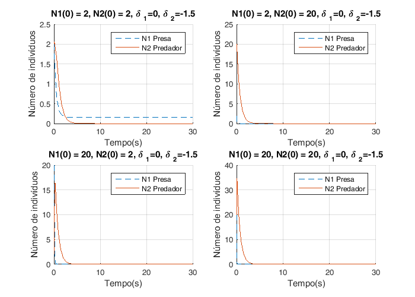

### Questões 2.2 e 2.3 - Soluções em que a Presa se extingue e o Predador cresce indefinidamente{#20}


Soluções para delta1 = 3.5 e delta2 = -2.5

``` matlab
figure(n)
fig = figure(n);
set(fig, 'Position', [0, 0, 700, 500])  % x, y, largura e comprimento da figura
n=n+1;
hold all;
delta1=0;
delta2=1;
k=1;
tsim=0.5;
for N10=[2 20]
    for N20=[2 20]
        sim('predador_presa')
        subplot(2,2,k)
        hold all;
        k=k+1;
        plot(t, N1,'--','DisplayName', 'N1 Presa')
        plot(t, N2, 'DisplayName', 'N2 Predador')
        title(['N1(0) = ',num2str(N10),', N2(0) = ',num2str(N20),', {\delta }_{1}=',num2str(delta1),', {\delta }_{2}=',num2str(delta2)])
        ylabel('Número de indivíduos')
        xlabel('Tempo(s)')
        grid on
        legend('show')
    end
end
```


### Questões 2.2 e 2.3 - Gráfico do espaço de fases N1 e N2 para direntes valores de N01 e N02{#22}

``` matlab
delta1 =5;
delta2 =-5;
tsim = 5;
figure(n)
n=n+1;
hold all;
for N10 =  [20 2]
   for N20 = [15 4]
        sim('predador_presa');
        factor=N10/N20;
        plot(N1, N2,'DisplayName',['N1(0)/N2(0) = ', num2str(factor)])
   end
end
xlabel('Número de Presas (N1)')
ylabel('Número de Predadores (N2)')
title('Gráfico em espaço de fase (N1,N2)')
legend('show')
```


### Questão 2.4.a) Aproximação por tentativa e erro{#23}

Simulando o sistema para diferentes valores das características N2(0) e
 dos predadores,
obteve-se, por tentativa e erro, uma evoluçõão temporal do número de
presas aproximada à curva fornecida.

``` matlab
load('presas.mat')
% carregamento do ficheiro presas.mat que contem valores para uma populacao
% de presas ao longo do tempo
delta1=3.1;
alpha1=1.4;
delta2=-1.5;
N10=4;
figure(n)
fig = figure(n);
set(fig, 'Position', [0, 0, 700, 500])  % x, y, largura e comprimento da figura
n=n+1;
hold all;
alpha2_aux=[0.7  0.7];
N20_aux=[1.6 1.6];
hold all;
plot(tr, yr, 'DisplayName', 'Presas(N1) (dados)')
for k=1:1
    N20 = N20_aux(k);
    alpha2 = alpha2_aux(k);
    sim('predador_presa',tr)
    plot(tr, N1,'--','DisplayName',['Presas(N1) (simulação), {\alpha }_{2}=',num2str(alpha2),', N2(0) = ',num2str(N20)])
end
XMIN=0; XMAX=20; YMIN=0; YMAX=6;
axis ([XMIN XMAX YMIN YMAX]);
legend('show')
title('Aproximação dos dados recolhidos por simulação')
ylabel('Número de indivíduos N1(t) ')
xlabel('Tempo(s)')
grid on
```


foi obtida por tentativa e erro a Seguinte aproximação:

N2(0)= 1.6 e = 0.7

### Questão 2.4.b) Ajuste de parâmetros por estimação do erro absoluto{#26}

De forma a obter uma estimativa dos valores de N2(0) e
 da população de
predadores começa-se por fazer um varrimento de possíveis valores destes
parâmetros e, para cada par de valores, estimar o erro absoluto ou soma
dos valores absolutos das diferenças entre os valores fornecidos e os
calculados. Os valores são escolhidos tendo em conta que, na alínea
anterior, foi obtida uma aproximação aos valores de N2(0) e
 por tentativa e
erro. Na alínea anterior foram obtidos dois pares de valores: N2(0)= 1.6
e =0.7

``` matlab
p=15; % numero de valores de N0 e alpha a testar
erros = zeros(p, p); % icialização da matriz com os valores de erro
N20_min=1.4;
N20_max=1.8;
alpha2_min=0.5;
alpha2_max=0.9;
```

Pelas aproximacoes feitas na alinea 2.4a) sabemos que valores de
 e N2(0) estão
dentro destes parametros, e os intervalos foram escolhidos de modo a
haver coerencia entre os dados fornecidos pelo ficheiro presas.mat

``` matlab
N20_aux=linspace(N20_min,N20_max,p);
% N2(0) -> espaço linear, vector de p pontos entre N20_min e N20_max
alpha2_aux=linspace(alpha2_min,alpha2_max,p);
% alpha2 -> espaço linear, vector de p pontos entre alpha2_min e alpha2_max

h = waitbar(0, 'A calcular erros... Está quase...');
set(h,'HandleVisibility','off')
for i=1:p
    for j=1:p
        alpha2 = alpha2_aux(i);
        N20 = N20_aux(j);
        % erros(i,j)=erro([N20_aux(j) alpha2_aux(i)]);
        erros(i,j)=erro([N20 alpha2]);
    end
    delete(h);
    h = waitbar(i/p, 'A calcular erros... Está quase...');
    % barra de loading a apresentar durante simulação
end
delete(h);

figure(n)
fig = figure(n);
set(fig, 'Position', [0, 0, 700, 500])  % x, y, largura e comprimento da figura
n=n+1;
subplot(2,1,1)
surfc(alpha2_aux,N20_aux,erros);
xlabel('{\alpha }_{2}'); ylabel('N2(0)'); zlabel('Erro'); colorbar;
title('Superfície de Erro')
subplot(2,1,2)
contour(alpha2_aux,N20_aux,erros,100);% 100 linhas de contorno
xlabel('{\alpha }_{2}'); ylabel('N2(0)'); colorbar;
title('Curvas de nível')
```

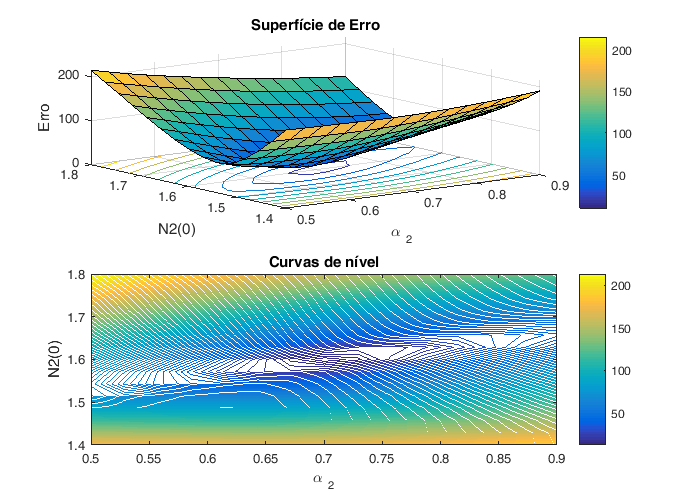

Os valores de  e
N2(0) não são facilmente estimados pela observação dos gráficos
anteriores, sendo apenas possível estimar um intervalo de valores. A
precisão da estimação depende do número (p) de valores a testar e do
intervalo entre o valor mínimo e o máximo. Os intervalos de valores para
 e N2(0) foram
escolhidos obsevando a surferficie de erro obtida vista de cima e
analisando dentro da curva mais estreita do grafico contour, obtendo-se:

N2(0)= \[1.586 , 1.614\] e
 = \[0.614 ,
0.74\]

Com base neste intervalaos vamos estimar de novo intervalos de valores
mais precisos

``` matlab
N20_min=1.586;
N20_max=1.614;
alpha2_min=0.674;
alpha2_max=0.74;
N20_aux=linspace(N20_min,N20_max,p);
alpha2_aux=linspace(alpha2_min,alpha2_max,p);

h = waitbar(0, 'A calcular erros... Está quase...');
set(h,'HandleVisibility','off')
for i=1:p
    for j=1:p
        alpha2 = alpha2_aux(i);
        N20 = N20_aux(j);
        erros(i,j)=erro([N20 alpha2]);
    end
    delete(h);
    h = waitbar(i/p, 'A calcular erros... Está quase...');
end
delete(h);

figure(n)
fig = figure(n);
set(fig, 'Position', [0, 0, 700, 500])  % x, y, largura e comprimento da figura
n=n+1;
subplot(2,1,1)
surfc(alpha2_aux,N20_aux,erros);
xlabel('{\alpha }_{2}'); ylabel('N2(0)'); zlabel('Erro'); colorbar;
title('Superfície de Erro')
subplot(2,1,2)
contour(alpha2_aux,N20_aux,erros,100);% 100 linhas de contorno
xlabel('{\alpha }_{2}'); ylabel('N2(0)'); colorbar;
title('Curvas de nível')
```

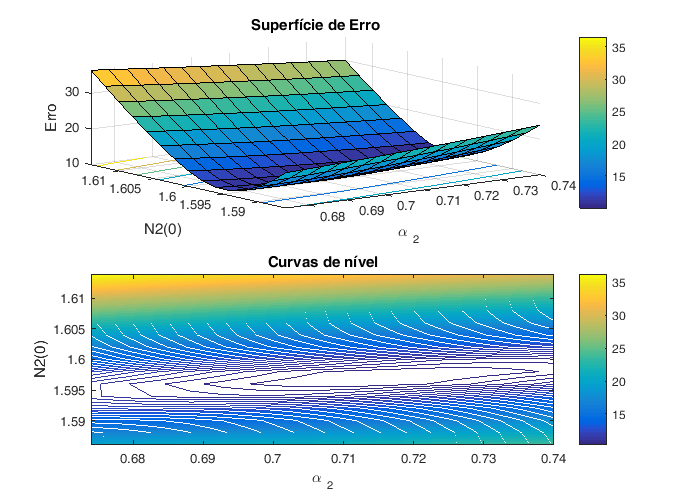

Pelo que se conclui que o mínimo global é, aproximadamente:
 = 0.71 e
N2(0)=1.597

### Questão 2.4.c) Obtenção dos parametros por calculo exacto do erro mínimo{#31}

Utilizando um método de optimização, pretende-se calcular o mínimo erro
de forma mais eficientea que na alínea anterior. Recorrendo à função
fminsearch, que calcula o mínimo local, vamos obter os valores mínimos
de  e N02 partindo
dos valores obtidos na alínea anterior:
 = 0.71 e
N2(0)=1.597

``` matlab
optimo = fminsearch(@erro, [1.597 0.71]);
```

optimo contem o valor preciso de alpha2 e N2(0) que melhor optimizam a
evolucao temporal do modelo. Com esta função podemos obter um resultado
mais exacto do que na alinea anterior, caso os valores inicias dos pares
alpha2 e N2(0) forem o mais correctos. Se não forem bem escolhidos o
valor returnado será um mínimo local em vez de um mínimo absoluto da
função.

``` matlab
disp(strcat('N2(0)=',num2str(optimo(1))));
disp(strcat('alpha2=',num2str(optimo(2))));
```

``` matlab
N2(0)=1.6042
alpha2=0.70033
```

Os resultados obtidos nesta alíena diferem quase nada dos ecolhidos dos
gráficos, sendo N02 = 1.6042 e
= 0.70033. Por
observação dos gráficos concluimos que este valores obtidos estes se
encontram na gama de valores das curvas de nível com menor erro. Se
forem dados valores inciais afastados das curvas de erro mínimo a função
retorna um valor muito diferente. Por exemplo, para N2(0)=10 e
=1 O mínimo local
obtido pela função fminsearch é:

``` matlab
optimo2 = fminsearch(@erro, [10 1]);
disp(strcat('N2(0)=',num2str(optimo2(1))));
disp(strcat('alpha2=',num2str(optimo2(2))));
```

``` matlab
N2(0)=4.1239
alpha2=2.5442
```

Tal como esperado obtemos valores que não correspodem a uma boa
aproximação N02 = 4.1239 e
 = 2.5442

### Questão 2.4.d) Validação do modelo por obtenção do erro mínimo{#36}

Simulando o sistema de equações para os valores de erro mínimo, obtém-se
o seguinte gráfico:

``` matlab
alpha1=1.4;
delta1=3.1;
delta2=-1.5;
N10 = 4;
load('presas.mat')
alpha2 = optimo(2);
N20 = optimo(1);
sim('predador_presa', tr)

figure(n)
n=n+1;
plot(tr,N1,tr,yr,'o')
title('Simulação para valores de N2(0) e {\alpha }_{2} de erro mínimo')
xlabel('Tempo(s)')
ylabel('Número de Indívíduos N1(t)')
legend('Presa (simulação)', 'Presa (dados)')
grid on
```

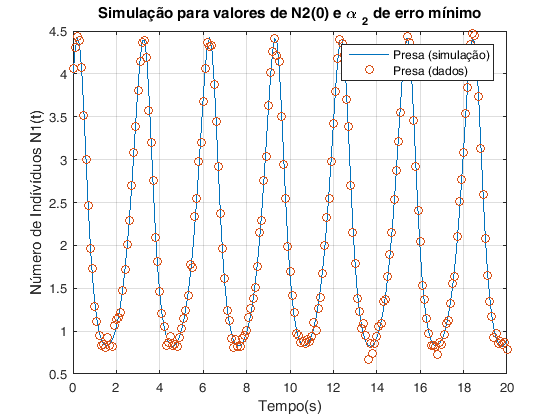

Como podemos averiguar os valores dos parâmetros estimados N2(0) e
 permitem-nos
obter uma boa aproximação da curva proveniente dos dados. A solução do
sistema para os valores estimados inclui os pontos da curva fornecida
por simulação excepto os valores afectados pelo ruído.

### Questão 3.1 Sistema Caótico{#39}

Como estamos em repouso inicial, consideramos que t10\' = t20\' = 0,
sendo t10\' e t20´ as velocidades angulares iniciais de cada um dos
braços. Por conseguinte, obtemos p1 = p2 = 0.

``` matlab
open_system('pendulo')

p10 = 0;
p20 = 0;

% Simulação de teste com t10 = t10 = pi/10:
t10 = pi/10;
t20 = pi/10;

sim('pendulo', 15)
figure(n);
plot(t,t1,t,t2);
title('Simulação de Teste');
legend('Teta1','Teta2')

n=n+1;
```

 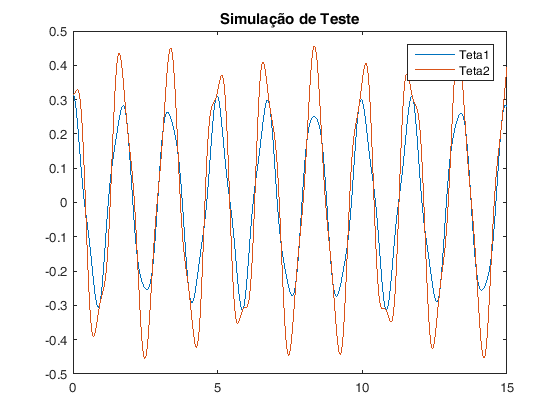

### Questão 3.2 Curva de Lissajous{#40}

Para obter uma figura que se parecesse com a curva de Lissajous, opta-se
por tomar t10 = t20 = pi/10.

``` matlab
sim('pendulo', 3)
figure(n);
plot(t1,t2);
title('Curva de Lissajous');
xlabel('Teta1');
ylabel('Teta2');

n=n+1;
```


Aumentando a amplitude da deflexão inicial do pêndulo obtemos:

``` matlab
for i = [pi/5 pi/2 3]

    t10 = i;
    t20 = i;

    sim('pendulo', 3)
    figure(n);
    plot(t1,t2);
    xlabel('Teta1');
    ylabel('Teta2');
    n = n+1;

end
```

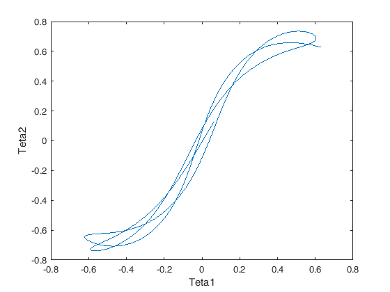 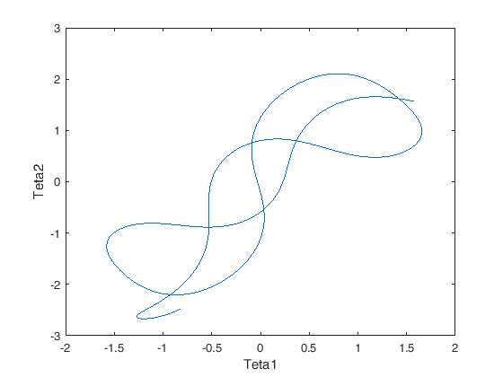 

Como podemos claramente verificar, á medida que aumentamos o Teta1 e
Teta2 iniciais, a figura fica cada vez mais irregular.

### Questão 3.3 Soluções posíveis{#43}

``` matlab
figure(n)
n=n+1;
I = imread('./figures/3.3.1.jpg');
J = imresize(I, 0.6);
imshow(J);
figure(n)
n=n+1;
I = imread('./figures/3.3.2.jpg');
J = imresize(I, 0.6);
imshow(J);
```

 

### Questão 3.4 - Determinação do tempo que decorre até uma das barras "fazer um looping"{#44}

``` matlab
m=1;
l=0.5;
```

``` matlab
%Começamos por criar 2 vectores x e y com as coordenadas x e y,
%respectivamente, da posição inicial da ponta do pêndulo
```

``` matlab
x0=[-0.5 0.01 -0.1 0.00001];
y0=[-0.5 0.01 0.5 0.9999];

j=1;

for i=1:length(x0)

    x=x0(i);
    y=y0(i);

    %Cálculo dos ângulos teta1 e teta2 iniciais
    %correspondentes as valores x e y inicias.
    teta10(i)=acos((((power(x,2)+power(y,2))/(2*x))*(y/x)+sqrt(power(y/x,2)*power(l,2)+power(l,2)-power((power(x,2)+power(y,2))/(2*x),2)))/((power(y/x,2)+1)*l));
    teta20(i)=acos((y-(((power(x,2)+power(y,2))/(2*x))*(y/x)+sqrt(power(y/x,2)*power(l,2)+power(l,2)-power((power(x,2)+power(y,2))/(2*x),2)))/((power(y/x,2)+1)))/l);

    %Cálculo do p1 e p2 correspondentes a cada um dos ângulos iniciais e para teta1'(0) = 0º/s e teta2'(0) = -30º/s
    p1_ref(i)=-10*m*power(l,2);
    p2_ref(i)=-15*m*power(l,2)*cos(teta10(i)-teta20(i));

    t10=teta10(i);
    t20=teta20(i);
    p1=p1_ref(i);
    p2=p2_ref(i);

    %Simulação do sistema:
    sim('pendulo', 250)
    figure(n);
    plot(t1,t2);
    xlabel('Teta1');
    ylabel('Teta2');
    n=n+1;

    % Antes de se iniciar a próxima simulação com outro ponto de partida
    % inicial da ponta do pêndulo, vamos verificar o tempo que se demorou até acontecer o primeiro
    % looping em uma das barras. Na primeira linha da matriz t_loop, guardamos os tempos de
    % loop de cada simulação. Para cada tempo de loop, se estiver impresso
    % um "1" na mesma coluna deste tempo na segunda linha, significa que o
    % loop realizou-se no braço 1. Se estiver um "1" na terceira linha,
    % significa que se realizou o loop no braço 2. Na 4.º linha de cada
    % coluna tempos o valor do ângulo onde ocorreu o looping.


    for i=1:length(t1)

        % Verificação de looping no braço 1:

            if(t1(i) > (t10+2*pi))
                % SUCESSO: Looping no braço 1!
                t_loop(1,j)=t(i);
                t_loop(2,j)=1;
                t_loop(4,j)=t1(i);
                break
            end
            if(t1(i) < (t10-2*pi))
               % SUCESSO: Looping no Braço 1!
               t_loop(1,j)=t(i);
               t_loop(2,j)=1;
               t_loop(4,j)=t1(i);
               break
            end

        % Verificação de looping no braço 2:

            if(t2(i) > (t20+2*pi))
                % SUCESSO: Looping no braço 2!
                t_loop(1,j)=t(i);
                t_loop(3,j)=1;
                t_loop(4,j)=t2(i);
                break
            end
            if(t2(i) < (t20-2*pi))
               % SUCESSO: Looping no Braço 2!
               t_loop(1,j)=t(i);
               t_loop(3,j)=1;
               t_loop(4,j)=t2(i);
               break
            end
    end
    j=j+1;

end

%Tempos de simulação apropriados
sim_temp = [10, 50, 100];
```

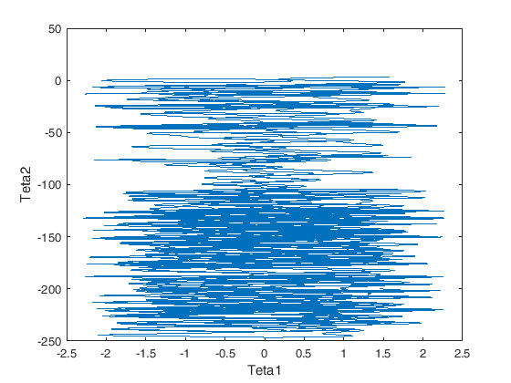   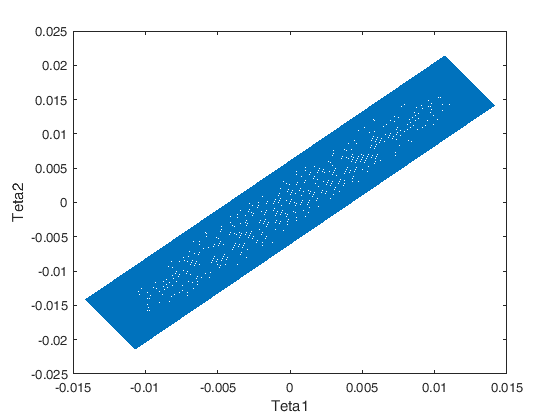

Simulação dos pontos inciais novamente de modo a obter gráficos das
evoluções temporais do teta1 ou teta2 com os instantes onde ocorre
looping assinalados.

``` matlab
for i=1:2

    % Aqui Fazemos apenas 2 simulações porque apenas conseguimos 2 das 3
    % configurações pretendidas. As configurações em que os loopings estão
    % contidos em [0,30]s e [30,100]s.

    x=x0(i);
    y=y0(i);

    teta10(i)=acos((((power(x,2)+power(y,2))/(2*x))*(y/x)+sqrt(power(y/x,2)*power(l,2)+power(l,2)-power((power(x,2)+power(y,2))/(2*x),2)))/((power(y/x,2)+1)*l));
    teta20(i)=acos((y-(((power(x,2)+power(y,2))/(2*x))*(y/x)+sqrt(power(y/x,2)*power(l,2)+power(l,2)-power((power(x,2)+power(y,2))/(2*x),2)))/((power(y/x,2)+1)))/l);

    p1_ref(i)=-10*m*power(l,2);
    p2_ref(i)=-15*m*power(l,2)*cos(teta10(i)-teta20(i));

    t10=teta10(i);
    t20=teta20(i);
    p1=p1_ref(i);
    p2=p2_ref(i);

    sim('pendulo', sim_temp(i))
    figure(n);

    if t_loop(2,i)==1
        plot(t,t1);
        hold on;
        plot(t_loop(i,1),t_loop(i,4),'ro');
        xlabel('Tempo');
        ylabel('Teta1');
        n=n+1;
    end
    if t_loop(3,i)==1
        plot(t,t2);
        hold on;
        plot(t_loop(1,i),t_loop(4,i),'ro');
        xlabel('Tempo');
        ylabel('Teta2');
        n=n+1;
    end
end
```

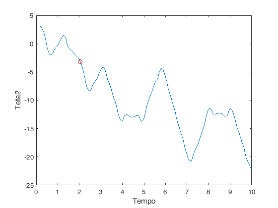 


# Optimização do servomecanismo de um disco rígido

```{.language-matlab}
Autor: Diogo Vilar Sardinha
```

## Contents

- [Questão 1 - expressão analítica](#2)
- [Questão 2 - Geração do impulso protótipo](#3)
- [Questão 3 - Geração de um sinal de controlo u(t)](#5)
- [Questão 4 - Área de uma versão escalada em amplitude e no
  tempo](#7)
- [Questão 7 - Testes da dinâmica do sistema para diferentes
  parâmetros](#8)
- [Questão 8](#15)

```{.codeinput}
close all;
n=1;
% inicialização do contador para as figuras
```

## Questão 1 - expressão analítica{#2}

```{.codeinput}
n=1; % inicialização do contador para as figuras
figure(n)
n=n+1;I = imread('./figures/Scan10001.jpg');
imshow(I);
```


## Questão 2 - Geração do impulso protótipo{#3}

beta pertence ao intervalo \[0,1\]. beta controla a suavidade dos
flancos dos impulsos.

```{.codeinput}
beta = 0.6;
% criação do vector com os instantes de tempo
t_min=-1;
t_max=1;
p=100; % número de pontos para a escala do tempo
t=linspace(t_min,t_max,p);
% geradora - Função que gera o impulso protótipo.
impulso = geradora_pb(t,beta);

hold all;
figure(n);
n=n+1;
plot(t,impulso);
XMIN=-1; XMAX=1; YMIN=0; YMAX=1.5;
axis ([XMIN XMAX YMIN YMAX]);
grid on
xlabel('Tempo');
ylabel('Amplitude do impulso');
title('Impulso Protótipo');
```


## Questão 3 - Geração de um sinal de controlo u(t){#5}

Nesta questão pretende-se apenas testar se a função para criar u(t),
está correcta, definindo assim valores arbitrários para as amplitudes U1
e U2, para alpha, beta e valores de T.

```{.codeinput}
% duração total da forma de onda
T = 1;
alpha = 1.5;
% número de pontos para a escala do tempo de cada um dos impulsos
n1 = 100;
n2 = 100;
% Amplitudes
U1 = -1.5;
U2 = 1;
% Sinal u(t) e sua duração
[ut, tempo] = geradora_ut(T,alpha,beta,U1,U2,n1,n2);

figure(n);
n=n+1;
plot(tempo,ut);
grid on
xlabel('Tempo');
ylabel('Amplitude');
title('Sinal de controlo u(t)');
```


## Questão 4 - Área de uma versão escalada em amplitude e no tempo{#7}

```{.codeinput}
n=1; % inicialização do contador para as figuras
figure(n)
n=n+1;I = imread('./figures/Scan10002.png');
imshow(I);
```


## Questão 7 - Testes da dinâmica do sistema para diferentes parâmetros{#8}

Nesta questão simulamos a dinamica do sistema para diferentes valores
dos parametros que compõem o sinal de comcontrolo u(t)

Diagrama de blocos que simula a dinâmica do servomecanismo do disco
rígido

```{.codeinput}
open_system('dinamicadosistema')

% duração total do sinal de entrada u(t) (de controlo)
T = 1;
% número de pontos para a escala do tempo de cada um dos impulsos de u(t)
n1 = 100;
n2 = 100;
% Amplitudes
U1 = -1;
U2 = 1;
%Parametros a testar
beta_aux=[1 0.3 0.5 0.0001];
alpha_aux=[0.5 1 2 1];
%Estados Iniciais
dy0=0;
y0=1;
```

Sinais de controlo u(t)

```{.codeinput}
% Simulações sem perturbação do sistema com efeito de atrito (b=0)
b=0;
figure(n)
fig = figure(n);
set(fig, 'Position', [0, 0, 700, 500])  % x, y, largura e comprimento da figura
n=n+1;
hold all;
for k=1:4
    beta = beta_aux(k);
    alpha = alpha_aux(k);
    [ut, tempo] = geradora_ut(T,alpha,beta,U1,U2,n1,n2);
    entrada = [tempo' ut'];
    sim('dinamicadosistema',tempo);
    plot(tempo,ut,'DisplayName', ['{\beta }=',num2str(beta),', {\alpha }=',num2str(alpha),', b=',num2str(b)]);
end
xlabel('Tempo');
ylabel('Amplitude');
title('Sinais de controlo u(t)');
grid on
legend('show')
```


Velocidades angulares para diferentes parametros

```{.codeinput}
% Simulações sem perturbação do sistema com efeito de atrito (b=0)
b=0;
figure(n)
fig = figure(n);
set(fig, 'Position', [0, 0, 800, 500])  % x, y, largura e comprimento da figura
n=n+1;
subplot(1,2,1)
hold all;
for k=1:4
    beta = beta_aux(k);
    alpha = alpha_aux(k);
    [ut, tempo] = geradora_ut(T,alpha,beta,U1,U2,n1,n2);
    entrada = [tempo' ut'];
    sim('dinamicadosistema',tempo);
    plot(tout,v,'DisplayName', ['Sinais {\beta }=',num2str(beta),', {\alpha }=',num2str(alpha),', b=',num2str(b)]);
end
xlabel('Tempo');
ylabel('Velocidade Angular');
title('Velocidades angulares sem efeito de atrito');
grid on
legend('show')


% Simulações com perturbação do sistema com efeito de atrito (b=0.025)
b=0.025;
subplot(1,2,2)
hold all;
for k=1:4
    beta = beta_aux(k);
    alpha = alpha_aux(k);
    [ut, tempo] = geradora_ut(T,alpha,beta,U1,U2,n1,n2);
    entrada = [tempo' ut'];
    sim('dinamicadosistema',tempo);
    plot(tout,v,'DisplayName', ['Sinais {\beta }=',num2str(beta),', {\alpha }=',num2str(alpha),', b=',num2str(b)]);
end
xlabel('Tempo');
ylabel('Velocidade Angular');
title('Velocidades angulares com efeito de atrito');
grid on
legend('show')
```


Posições angulares para diferentes parametros

```{.codeinput}
% Simulações sem perturbação do sistema com efeito de atrito (b=0)
b=0;
figure(n)
fig = figure(n);
set(fig, 'Position', [0, 0, 700, 500])  % x, y, largura e comprimento da figura
n=n+1;
subplot(1,2,1)
hold all;
for k=1:4
    beta = beta_aux(k);
    alpha = alpha_aux(k);
    [ut, tempo] = geradora_ut(T,alpha,beta,U1,U2,n1,n2);
    entrada = [tempo' ut'];
    sim('dinamicadosistema',tempo);
    plot(tout,y,'DisplayName', ['Sinais {\beta }=',num2str(beta),', {\alpha }=',num2str(alpha),', b=',num2str(b)]);
end
xlabel('Tempo');
ylabel('Posição');
title('Posição angular sem efeito de atrito');
grid on
legend('show')


% Simulações com perturbação do sistema com efeito de atrito (b=0.025)
b=0.025;
subplot(1,2,2)
hold all;
for k=1:4
    beta = beta_aux(k);
    alpha = alpha_aux(k);
    [ut, tempo] = geradora_ut(T,alpha,beta,U1,U2,n1,n2);
    entrada = [tempo' ut'];
    sim('dinamicadosistema',tempo);
    plot(tout,y,'DisplayName', ['Sinais {\beta }=',num2str(beta),', {\alpha }=',num2str(alpha),', b=',num2str(b)]);
end
xlabel('Tempo');
ylabel('Posição');
title('Posição angular com efeito de atrito');
grid on
legend('show')
```


Infelizmente devido à falta de tempo não foi feita a analise teorica
correctamente. Os valores finais da velocidade e da posição da cabeça do
disco deviam tender para zero o que não se verifica em todos os casos.
Para além disto o modelo não apresenta diferenças significativas quando
se considera o efeito de atrito (b\>0), o que não devia ser verdade pois
o atrito leva a que não seja antingida a posição pertendida e ocorreria
uma redução de velocidade.

## Questão 8{#15}

```{.codeinput}
open_system('P8');

y=linspace(-5,5,100);
dy=linspace(-5,5,100);

sim('P8')

figure(n)
n=n+1;
surf(u);colorbar;
title('Pergunta 8 - Função de Geração u(y,dy)')
xlabel('Posição')
ylabel('Velocidade')
zlabel('u')
```

```{.codeoutput}
Warning: Source 'P8/From Workspace' specifies that its sample time (-1) is
back-inherited. You should explicitly specify the sample time of sources. You
can disable this diagnostic by setting the 'Source block specifies -1 sample
time' diagnostic to 'none' in the Sample Time group on the Diagnostics pane of
the Configuration Parameters dialog box. 
Warning: Source 'P8/From Workspace1' specifies that its sample time (-1) is
back-inherited. You should explicitly specify the sample time of sources. You
can disable this diagnostic by setting the 'Source block specifies -1 sample
time' diagnostic to 'none' in the Sample Time group on the Diagnostics pane of
the Configuration Parameters dialog box. 
Warning: Model 'P8' is using a default value of 0.2 for maximum step size. You
can disable this diagnostic by setting 'Automatic solver parameter selection'
diagnostic to 'none' in the Diagnostics page of the configuration parameters
dialog 
```


# Dinâmica de um metrónomo básico

```{.language-matlab}
Autor: Diogo Vilar Sardinha
```

## Contents

<div>

- [Questão 1 - Equação diferencial](#2)
- [Questão 2 - Modelo de Estado](#3)
- [Questão 3 e 4 - Função de Transferência](#4)
- [Questão 5](#5)
- [Questão 6](#11)
- [Questão 7](#15)
- [Questão 8](#20)
- [Questão 9](#22)
- [Questão 10](#29)
- [Questão 11](#35)

```{.codeinput}
close all;
clear;
n=1;
% inicialização do contador para as figuras
```

## Questão 1 - Equação diferencial{#2}

```{.codeinput}
n=1; % inicialização do contador para as figuras
figure(n)
n=n+1;I = imread('./figures/10001.jpg');
imshow(I);
```


## Questão 2 - Modelo de Estado{#3}

```{.codeinput}
figure(n)
n=n+1;
I = imread('./figures/10002.png');
imshow(I);
```

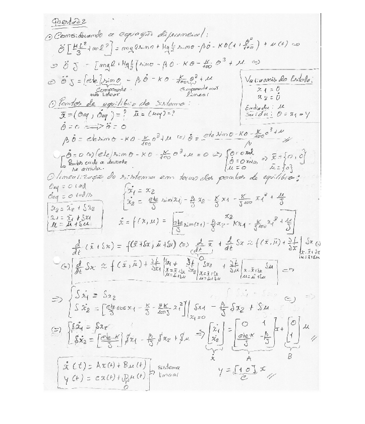

## Questão 3 e 4 - Função de Transferência{#4}

```{.codeinput}
figure(n)
n=n+1;
I = imread('./figures/10003.png');
J = imresize(I, 0.7);
imshow(J);
figure(n)
n=n+1;
I = imread('./figures/10004.png');
J = imresize(I, 0.7);
imshow(J);
```

```{.codeoutput}
Warning: Image is too big to fit on screen; displaying at 50% 
```

 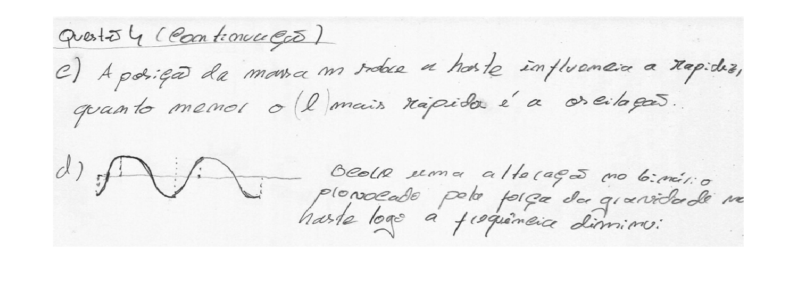

## Questão 5{#5}

Diagrama de blocos que simula a dinâmica de um metrónomo básico

```{.codeinput}
open_system('Q5')
```


De acordo com o modelo obtido na preparação teórica obtemos:

```{.codeinput}
% Dados do enunciado:
L=0.5;      % comprimento da haste
M=0.15;     % peso da haste
l=0.4;      % Distancia a que está a massa da origem
m=0.2;      % peso da massa
k=3;        % constante da mola
beta=0.1;   % coeficiente de atrito
g=9.8;      % aceleração da gravidade

% Condições Inicias:
teta0 = 0;  % ângulo inicial
v0 = pi/4 ; % velocidade angular inicial

% Valores do ganhos da retroacção da velocidade angular e do ângulo como
% é representado no diagrama de blocos:
cte1 = (beta) / ( ((M*(L^2))/3) + m*(l^2) );
cte2 = ( m*g*l + (M*g*L/2) -k ) / ( ((M*(L^2))/3) + m*(l^2) );

U=0; % Binário aplicado

sim('Q5',7)
```

Representação da evolução do ângulo e velocidade angular do sistema ao
longo do tempo:

```{.codeinput}
figure(n)
n=n+1;
hold all;
subplot(2,1,1)
plot(t,teta)
xlabel('Tempo [s]')
ylabel('{\theta}   [rad]')
grid on
title('Variação da Posição angular {\theta(t)}')
subplot(2,1,2)
plot(t,v)
xlabel('Tempo [s]')
ylabel(' {d\theta }/{dt}   [rad/s]')
grid on
title('Variação da Velocidade angular {d\theta(t)}/{dt} ')
```


Representação da evolução do ângulo e velocidade angular do sistema no
espaço de estados:

```{.codeinput}
figure(n)
n=n+1;
plot(teta,v)
title('Representação das variáveis de estado no espaço de estados')
xlabel('{\theta}   [rad]')
ylabel('{d\theta }/{dt}    [rad/s]')
grid on
```


Trata-se de um foco estável.

## Questão 6{#11}

```{.codeinput}
J = ((M*(L^2))/3) + m*(l^2); % Momento de inércia
A = [0 1;(m*g*l+(M*g*L/2)-k)/(((M*(L^2))/3)+m*(l^2)) -beta/J];
B = [0 1]';
C = [1 0;0 1];
D = [0 0]';
x0 = [0 pi/4]';
```

O diagrama de Simulink que simula o sistema recorrendo a um bloco de
modelo de estado pré-definido é:

```{.codeinput}
open_system('Q6')
```


As matrizes A e B foram obtidas na resolução teorica.

Para efeitos de simulação, a matriz C é definida por C=\[1 0;0 1\].
Desta forma a saída Y é uma matriz que contém as variáveis de estado
(posição e velocidade angular).

A matriz D é uma matriz nula.

## Questão 7{#15}

Representação grafica da resposta no tempo para

=0 e

=1.

```{.codeinput}
beta_aux=[0 1];
figure(n)
fig = figure(n);
set(fig, 'Position', [0, 0, 900, 500])  % x, y, largura e comprimento da figura
n=n+1;
hold all;
for p=1:2
    beta=beta_aux(p);
    A = [0 1;(m*g*l+(M*g*L/2)-k)/(((M*(L^2))/3)+m*(l^2)) -beta/J];
    sim('Q6',4)

    subplot(2,2,p)
    plot(t,Y(:,1)) % Y(todas as linahs, coluna 1)
    title(['Respostas no tempo da Posição angular {\theta(t)} para {\beta}=',num2str(beta)])
    xlabel('Tempo [s]')
    ylabel('{\theta}  [rad]')
    grid on

    subplot(2,2,p+2)
    plot(t,Y(:,2)) % Y(todas as linahs, coluna 2)
    title(['Respostas no tempo da velocidade angular para {\beta}=',num2str(beta)])
    xlabel('Tempo [s]')
    ylabel('{d\theta }/{dt}  [rad/s]')
    grid on
end
```

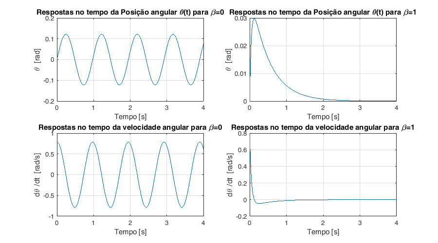

Representação grafica da evolução do sistema no plano de estado para

=0 e

=1.

```{.codeinput}
beta_aux=[0 1];
figure(n)
fig = figure(n);
set(fig, 'Position', [0, 0, 900, 350])  % x, y, largura e comprimento da figura
n=n+1;
hold all;
for p=1:2
    beta=beta_aux(p);
    A = [0 1;(m*g*l+(M*g*L/2)-k)/(((M*(L^2))/3)+m*(l^2)) -beta/J];
    sim('Q6',4)
    subplot(1,2,p)
    plot(Y(:,1),Y(:,2))
    title(['Evolução do sistema no plano de estado para {\beta}=',num2str(beta)])
    xlabel('{\theta}   [rad]')
    ylabel('{d\theta }/{dt}    [rad/s]')
    grid on
end
```


Representação grafica da evolução do sistema no plano de estado para

=0 e

=1 considerando várias
condições iníciais.

```{.codeinput}
p=20; %numero de condições iniciais a testar
col1= linspace(-pi,pi,p); % intervalo de posições angulares iniciais a testar
col2= linspace(-2*pi,2*pi,p); %intervalo de velocidades nagulares iniciais a testar
x0= [col1; col2]; %inicialização de x0
x0_aux =  transpose(x0);
aux = size(x0_aux); %aux guarda o numero de colunas e numero de linhas
p_aux = aux(1); %p_aux guarda o número de linhas

for beta=[0 0.1 1]
    figure(n)
    fig = figure(n);
    set(fig, 'Position', [0, 0, 1200, 500])  % x, y, largura e comprimento da figura
    n=n+1;
    hold all;
    for p=1:p_aux
        A = [0 1;(m*g*l+(M*g*L/2)-k)/(((M*(L^2))/3)+m*(l^2)) -beta/J];
        x0=x0_aux(p,:);
        sim('Q6',4)
        plot(Y(:,1),Y(:,2),'DisplayName',['[{\theta} , {d\theta }/{dt}] = ', num2str(x0) ])
    end
    xlabel('{\theta}   [rad]')
    ylabel('{d\theta }/{dt}    [rad/s]')
    grid on
    title(['Evolução do sistema no plano de estado para {\beta}=',num2str(beta)])
    legend('show')
    %Inicialização das matrizes que guardam as componentes horizontais e
    %verticais que constituem cada vector do campo vectorial:
    cx= zeros(p_aux,p_aux); %componente em x
    cy= zeros(p_aux,p_aux); %componente em y
    Max = max(Y);
    mini = min(Y);
    %intervalos de pontos na horizontal do campo vectorial
    xx = col1;
    %intervalos de pontos na vertical do campo vectorial:
    if abs(Max(2))<=abs(mini(2))
        yy = linspace(-mini(2),mini(2),p);
    end
    if abs(Max(2))>=abs(mini(2))
        yy = linspace(-Max(2),Max(2),p);
    end
    % Criação da matriz que contem as componetes horizontais e
    % verticais de cada vector do campo vectorial:
    for i=1:p
        for j=1:p
            aux1=A*[xx(i);yy(j)];
            cx(j,i)=aux1(1);
            cy(j,i)=aux1(2);
        end
    end
    quiver(xx,yy,cx,cy)
    %V ectores e valores próprios da matriz A:
    [eigenvectors,eigenvalues] = eig(A,'matrix');
    disp(' ');
    disp(strcat('Para beta = ',num2str(beta),':'));
    disp(' ');
    disp('Matriz Modal cujas colunas são os Vectores Próprios de A:');
    disp(eigenvectors);
    disp('Matriz Diagonal dos Valores Próprios de A:');
    disp(eigenvalues);
end
```

```{.codeoutput}
 
Para beta =0:
 
Matriz Modal cujas colunas são os Vectores Próprios de A:
   0.0000 - 0.1533i   0.0000 + 0.1533i
   0.9882 + 0.0000i   0.9882 + 0.0000i

Matriz Diagonal dos Valores Próprios de A:
   0.0000 + 6.4451i   0.0000 + 0.0000i
   0.0000 + 0.0000i   0.0000 - 6.4451i

 
Para beta =0.1:
 
Matriz Modal cujas colunas são os Vectores Próprios de A:
  -0.0267 - 0.1510i  -0.0267 + 0.1510i
   0.9882 + 0.0000i   0.9882 + 0.0000i

Matriz Diagonal dos Valores Próprios de A:
  -1.1236 + 6.3464i   0.0000 + 0.0000i
   0.0000 + 0.0000i  -1.1236 - 6.3464i

 
Para beta =1:
 
Matriz Modal cujas colunas são os Vectores Próprios de A:
    0.4415   -0.0489
   -0.8973    0.9988

Matriz Diagonal dos Valores Próprios de A:
   -2.0323         0
         0  -20.4396
```

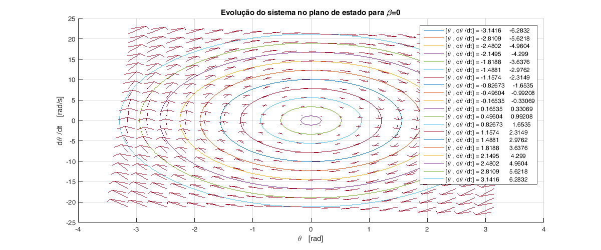  

Quando 
=0, os valores próprios
são puramente imaginários, o que origina uma resposta oscilatória
constante, representada por uma circunferência no plano de estado.

Quando 
=0.1, os valores
próprios são complexos com parte real negativa, o que resulta numa
resposta oscilatória a tender para a origem.

Quando 
=1, os valores próprios
são reais e negativos, o que origina uma resposta com forma exponecial a
tender para zero sem oscilação.

## Questão 8{#20}

Representação da evolução no plano de estados de duas trajectorias
rectilineas com 
=1.

Se a condição inicial x0 for um múltiplo escalar de um dos vectores
próprios v1 ou v2, a evolução da trajectoria nos espaço de estados é
rectílínea.

```{.codeinput}
figure(n)
n=n+1;
I = imread('./figures/10008.png');
imshow(I);

figure(n)
n=n+1;
hold all;
for i=1:2
    x0=3*eigenvectors(:,i);
    sim('Q6',6)
    plot(Y(:,1),Y(:,2))
end
legend('x0 = 3*v1','x0 = 3*v2')
xlabel('{\theta}   [rad]')
ylabel('{d\theta }/{dt}    [rad/s]')
grid on
title(['Evolução do sistema no plano de estado com trajectorias rectílineas para {\beta}=',num2str(beta)])
```

```{.codeoutput}
Warning: Image is too big to fit on screen; displaying at 67% 
```

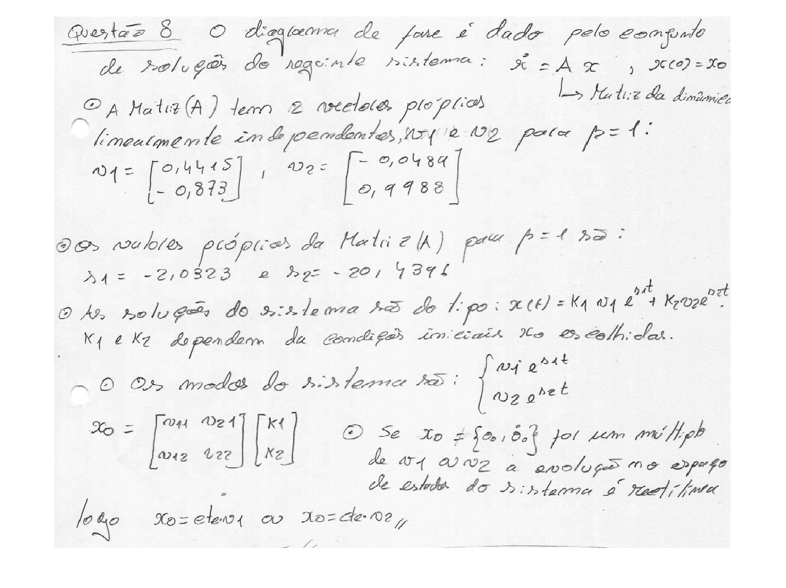 

## Questão 9{#22}

Estimar os parametros l e m da massa na haste do metronomo

```{.codeinput}
L = 0.25; %Comprimento da haste
M = 0.1; %Peso da haste
k = 0.35; %Constante da mola
beta = 0.001; %Coeficiente de atrito
g = 9.8; %Aceleração da gravidade
U=0; %binário aplicado é nulo
x0=[pi/10 pi]';

p=30; %numero de condições iniciais a testar
m_temp = linspace(0,0.2,p);
l_temp = linspace(0.05,L,p);
wa=zeros(p,p);

for i=1:p
    for j=1:p
        m = m_temp(i);
        l = l_temp(j);
        J = ((M*(L^2))/3) + m*(l^2); % Momento de inércia
        cte= m*g*l+M*g*L/2;
        wn = sqrt((k-cte)/J);
        qsi = beta/(2*J*sqrt((k-cte)/J));
        aux  = wn*sqrt(1-power(qsi,2));
        wa(i,j) = abs(aux);
    end
end

figure(n);
n = n+1;
contour(m_temp,l_temp,wa,'ShowText','on');
xlabel('massa(m)'); ylabel('Distancia da massa(l)'); colorbar;
```


Temos wa=2\*pi\*f; bpm = f\*60\*2; logo obtemos:

```{.codeinput}
wa_50 = ((2*pi)*50)/120;  % frequência para 50bpm
wa_150 = ((2*pi)*150)/120; % frequência para 150bpm
wa_76 = ((2*pi)*76)/120;   % frequência para 76bpm
wa_124 = ((2*pi)*124)/120; % frequência para 124bpm
```

150BPM equivale a uma velocidade angular de 5pi/2 rad/s \~ 7.854 rad/s

50 BPM equivale a uma velocidade angular de pi/4 rad/s \~ 0.785 rad/s

124BPM equivale a uma velocidade angular de \~ 6.4926 rad/s

76 BPM equivale a uma velocidade angular de \~ 3.9794 rad/s

Analisando as curvas de nivel do gráfico para diferentes frequencias
podemos dizer que m=0.09 é um valor aceitavel para a massa m.

Utilizando este valor para a massa podemos determinar dois valores para
a a distancia l (l\>= 0.05) a que se encontra a massa, que permitam
obter no metrónomo as velocidades angulares correspondentes a 50 BPM
(lento), 150 BPM (allegro), 76 BPM e 124bpm.

```{.codeinput}
m=0.09;
for i=1:p
    l = l_temp(i);
    J = ((M*(L^2))/3) + m*(l^2); % Momento de inércia
    cte= m*g*l+M*g*L/2;
    wn = sqrt((k-cte)/J);
    qsi = beta/(2*J*sqrt((k-cte)/J));
    aux  = wn*sqrt(1-power(qsi,2));
    wa_new(i) = abs(aux);
end

figure(n);
n = n+1;
plot(l_temp,wa_new)
ylabel('Velocidade angular (wa) (rad/s)');
xlabel('Distancia da massa (l)');
grid on;

%Cálculo do comprimento da posição da massa para a cadência de 50 BMP
[m1,ind1] = min(abs(wa_50-wa_new));
disp(strcat('Posição da massa para 50 BPM: l= ', num2str(l_temp(ind1))));
%Cálculo do comprimento da posição da massa para a cadência de 150 BPM
[m2,ind2] = min(abs(wa_150-wa_new));
disp(strcat('Posição da massa para 150 BPM: l= ', num2str(l_temp(ind2))));
%Cálculo do comprimento da posição da massa para a cadência de 76 BMP
[m3,ind3] = min(abs(wa_76-wa_new));
disp(strcat('Posição da massa para 76 BPM: l= ', num2str(l_temp(ind3))));
%Cálculo do comprimento da posição da massa para a cadência de 124 BPM
[m4,ind4] = min(abs(wa_124-wa_new));
disp(strcat('Posição da massa para 124 BPM: l= ', num2str(l_temp(ind4))));
```

```{.codeoutput}
Posição da massa para 50 BPM: l=0.20862
Posição da massa para 150 BPM: l=0.077586
Posição da massa para 76 BPM: l=0.17414
Posição da massa para 124 BPM: l=0.10517
```


Concluimos que com m=0.09kg, se verifica:

Para 150 BPM : l=0.077586.

Para 50 BPM : l=0.20862.

Para 124 BPM : l=0.10517.

Para 76 BPM : l=0.17414.

Realizando a simulação vamos sobrepor graficamente a evolução da
oscilação da posição angular e a envolvente teorica e determinar a
frequencia de oscilação empirica para cada uma das situações

```{.codeinput}
U=0; % binário aplicado é nulo
m = 0.1;
bpm = [50 150 76 124];
x0 = [pi/4 0]';
aux = 1; % contador auxiliar para o ciclo for

figure(n);
fig = figure(n);
set(fig, 'Position', [0, 0, 900, 500])  % x, y, largura e comprimento da figura
n = n+1;
for l=[l_temp(ind1) l_temp(ind2) l_temp(ind3) l_temp(ind4)]
    J = ((M*(L^2))/3) + m*(l^2); % Momento de inércia
    cte= m*g*l+M*g*L/2;
    wn = sqrt((k-cte)/J);
    qsi = beta/(2*J*sqrt((k-cte)/J));
    A = [0 1;(m*g*l+(M*g*L/2)-k)/(((M*(L^2))/3)+m*(l^2)) -beta/J];
    B = [0 1]';
    sim('Q6', 20);
    tau = exp(-qsi*wn*t); % constantes de tempo de decaimento
    subplot(2,2,aux)
    hold all;
    plot(t,Y(:,1));
    % Representar os decaimentos superior e inferior:
    plot(t, tau);
    plot(t, -tau);
    xlabel('Tempo (s)');
    ylabel('{\theta}   [rad]')
    title(strcat('Variação de {\theta} para ',num2str(bpm(aux)),' BPM'));
    grid on;
    % Determinação dos valores dos picos e os seus índices de forma a
    % determinar os instantes em que ocorrem:
    [picos, loc] = findpeaks(Y(:,1));
    t_picos = zeros(1,length(loc));
    % frequencia de oscilação entre dois picos:
    wa_e = zeros(1,length(t_picos)-1);
    % inicialização da variavel que guarda a soma das frequencias de
    % oscilação entre cada par de picos:
    soma_wa = 0;
    % Instantes de tempo em que se encontram os picos:
    for i = 1:length(t_picos)
        t_picos(i) = t(loc(i));
    end
    % calacular a frequencia em cada intervalo de tempo (t_picos(i+1) - t_picos(i))
    for i = 1:length(wa_e)
        % sabendo que : wa = 2*pi*f = (2*pi)/(tempo):
        wa_e(i) = (2*pi) ./ (t_picos(i+1) - t_picos(i));
        % Somar as frequenciasobtidas em cada intervalo de tempo:
        soma_wa = soma_wa + wa_e(i);
    end
    % Por fim realizar a media das frequencias todas calculadas e
    % determinar a frequencia de oscilação empirica:
    media = soma_wa/length(wa_e);
    disp(strcat('Frequência angular para ',num2str(bpm(aux)),' BPM = ',num2str(media),'rad/s ' ));
    aux = aux+1;
end
```

```{.codeoutput}
Frequência angular para50 BPM =1.891rad/s
Frequência angular para150 BPM =7.508rad/s
Frequência angular para76 BPM =3.3321rad/s
Frequência angular para124 BPM =6.244rad/s
```

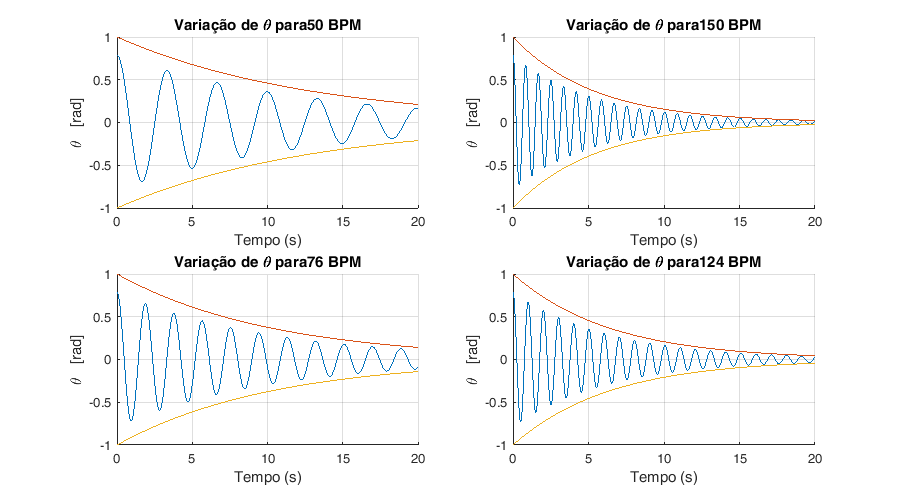

Através da análise dos gráficos, é possível concluir que o ângulo
apresenta variações de acordo com o esperado para ambas as frequências
embora com uma pequena discrepância entre a envolvente e a variação do
ângulo.

## Questão 10{#29}

Simulação para o modelo não linear do metronome cosiderando os valores
da questão 9.

```{.codeinput}
open_system('Q10');
```

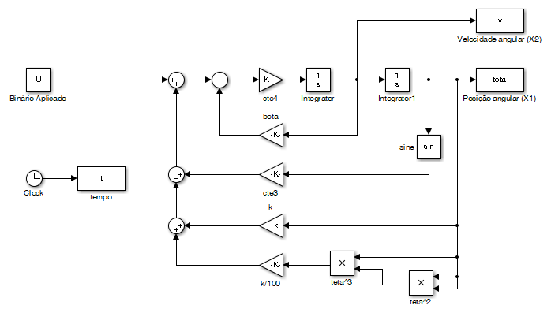

Usamos agora o dimensionamento da questão anterior:

```{.codeinput}
m = 0.09;
l_150 = 0.077586; % comprimento l para 150 BPM
l_50 = 0.20862; % comprimento l para 50 BPM
l_124 = 0.10517;% comprimento l para 124 BPM
l_76 = 0.17414; % comprimento l para 76 BPM
bpm = [50 150 76 124];
aux = 1;% contador auxiliar para o ciclo for
% Binário externo nulo:
U = 0;
% Condições Inicias:
teta0 = pi/4;  % ângulo inicial
v0 = 0 ; % velocidade angular inicial


% Simulação do sistema não linear para o comprimento l correspondente aos
% 150 BPM, 50 BPM, 74 BPM e 124 BPM:
figure(n);
fig = figure(n);
set(fig, 'Position', [0, 0, 900, 500])  % x, y, largura e comprimento da figura
n = n+1;

for l= [l_50 l_150 l_76 l_124]
    cte3 = m*g*l + M*g*L/2;
    cte4 = 1/(((M*(L^2))/3 + m*(l^2)));
    sim('Q10', 20);
    subplot(2,2,aux)
    plot(t,teta(:,1));
    xlabel('Tempo (s)');
    ylabel('{\theta}   [rad]')
    title(strcat('Variação de {\theta} para',num2str(bpm(aux)),' BPM no modelo não linear'));
    grid on;
    % Determinação dos valores dos picos e os seus índices de forma a
    % determinar os instantes em que ocorrem:
    [picos, loc] = findpeaks(teta(:,1));
    t_picos = zeros(1,length(loc));
    % wa_e é um vector em que cada indice guarda a frequencia de oscilação
    % entre dois picos:
    wa_e = zeros(1,length(t_picos)-1);
    % inicialização da variavel que guarda a soma das frequencias de
    % oscilação entre cada par de picos:
    soma_wa = 0;
    % Instantes de tempo em que se encontram os picos:
    for i = 1:length(t_picos)
        t_picos(i) = t(loc(i));
    end
    % calacular a frequencia em cada intervalo de tempo (t_picos(i+1) - t_picos(i))
    for i = 1:length(wa_e)
        % sabendo que : wa = 2*pi*f = (2*pi)/(tempo):
        wa_e(i) = (2*pi) ./ (t_picos(i+1) - t_picos(i));
        % Somar as frequenciasobtidas em cada intervalo de tempo:
        soma_wa = soma_wa + wa_e(i);
    end
    % Por fim realizar a media das frequencias todas calculadas e
    % determinar a frequencia de oscilação empirica:
    media = soma_wa/length(wa_e);
    disp(strcat('Frequência angular para ', num2str(bpm(aux)),' BPM = ', num2str(media),'rad/s ' ));
    aux = aux+1;
end
```

```{.codeoutput}
Frequência angular para50 BPM =2.8897rad/s
Frequência angular para150 BPM =7.8252rad/s
Frequência angular para76 BPM =4.0473rad/s
Frequência angular para124 BPM =6.6695rad/s
```


Conforme era esperado as frequências angulares são um pouco diferentes
comparadas com a simulação considerando um modelo linear.

Uma forma de redimensionar as posições da massa m para que as cadências
de oscilação se aproximem mais dos valores pretendidos consiste em
determinar o módulo da diferença entre a frequência pretendida e
frequência calculada com o sitema não linear.

```{.codeinput}
%Vector que contém os comprimentos que se vão obter
% ln = zeros(1, 2);
% aux = 1;

p=30; %numero de condições iniciais a testar
ls = linspace(0.05,0.25,p);
was = zeros(1,length(ls));
aux = 1;% contador auxiliar para o ciclo for
% Inicialização do vector que vai guardar os l que optimizam as
% frequanecias:
ls_opt= zeros(1,4);

for f = [2*pi*50/120 2*pi*150/120 2*pi*76/120 2*pi*124/120]

    for p = 1:length(ls)
        l=ls(p);
        cte3 = m*g*l + M*g*L/2;
        cte4 = 1/(((M*(L^2))/3 + m*(l^2)));
        sim('Q10', 20);
        % Determinação dos valores dos picos e os seus índices de forma a
        % determinar os instantes em que ocorrem:
        [picos, loc] = findpeaks(teta(:,1));
        t_picos = zeros(1,length(loc));
        % wa_e é um vector em que cada indice guarda a frequencia de oscilação
        % entre dois picos:
        wa_e = zeros(1,length(t_picos)-1);
        % inicialização da variavel que guarda a soma das frequencias de
        % oscilação entre cada par de picos:
        soma_wa = 0;
        % Instantes de tempo em que se encontram os picos:
        for i = 1:length(t_picos)
            t_picos(i) = t(loc(i));
        end
        % calacular a frequencia em cada intervalo de tempo (t_picos(i+1) - t_picos(i))
        for i = 1:length(wa_e)
            % sabendo que : wa = 2*pi*f = (2*pi)/(tempo):
            wa_e(i) = (2*pi) ./ (t_picos(i+1) - t_picos(i));
            % Somar as frequenciasobtidas em cada intervalo de tempo:
            soma_wa = soma_wa + wa_e(i);
        end
        % Por fim realizar a media das frequencias todas calculadas e
        % determinar a frequencia de oscilação empirica:
        media = soma_wa/length(wa_e);
        was(p)=abs(f - media);
    end
    % O mínimo local obtido pela função fminsearch é:
    [minimo,ind] = min(was);
    disp(strcat('Distancia l obtida para ',num2str(bpm(aux)),' BPM = ',num2str(ls(ind))));
    ls_opt(aux)=ls(ind);
    h = waitbar(aux/4, 'A calcular... Está quase...');
    % barra de loading a apresentar durante simulação
    delete(h)
    aux=aux+1;
end
```

```{.codeoutput}
Distancia l obtida para50 BPM =0.21552
Distancia l obtida para150 BPM =0.077586
Distancia l obtida para76 BPM =0.17414
Distancia l obtida para124 BPM =0.11207
```

Agora realizam-se de novo os cálculos das frequências angulares,
utilizando os novos valores optimizados para l :

```{.codeinput}
% Simulação do sistema não linear para valores de comprimento l optimizados
figure(n);
fig = figure(n);
set(fig, 'Position', [0, 0, 900, 500])  % x, y, largura e comprimento da figura
n = n+1;
aux=1;

for l= ls_opt
    cte3 = m*g*l + M*g*L/2;
    cte4 = 1/(((M*(L^2))/3 + m*(l^2)));
    sim('Q10', 20);
    subplot(2,2,aux)
    plot(t,teta(:,1));
    xlabel('Tempo (s)');
    ylabel('{\theta}   [rad]')
    title(strcat('Variação de {\theta} para',num2str(bpm(aux)),' BPM no modelo não linear'));
    grid on;
    % Determinação dos valores dos picos e os seus índices de forma a
    % determinar os instantes em que ocorrem:
    [picos, loc] = findpeaks(teta(:,1));
    t_picos = zeros(1,length(loc));
    % wa_e é um vector em que cada indice guarda a frequencia de oscilação
    % entre dois picos:
    wa_e = zeros(1,length(t_picos)-1);
    % inicialização da variavel que guarda a soma das frequencias de
    % oscilação entre cada par de picos:
    soma_wa = 0;
    % Instantes de tempo em que se encontram os picos:
    for i = 1:length(t_picos)
        t_picos(i) = t(loc(i));
    end
    % calacular a frequencia em cada intervalo de tempo (t_picos(i+1) - t_picos(i))
    for i = 1:length(wa_e)
        % sabendo que : wa = 2*pi*f = (2*pi)/(tempo):
        wa_e(i) = (2*pi) ./ (t_picos(i+1) - t_picos(i));
        % Somar as frequenciasobtidas em cada intervalo de tempo:
        soma_wa = soma_wa + wa_e(i);
    end
    % Por fim realizar a media das frequencias todas calculadas e
    % determinar a frequencia de oscilação empirica:
    media = soma_wa/length(wa_e);
    disp(strcat('Frequência angular para ', num2str(bpm(aux)),' BPM = ', num2str(media),'rad/s ' ));
    aux = aux+1;
end
```

```{.codeoutput}
Frequência angular para50 BPM =2.6724rad/s
Frequência angular para150 BPM =7.8252rad/s
Frequência angular para76 BPM =4.0472rad/s
Frequência angular para124 BPM =6.386rad/s
```

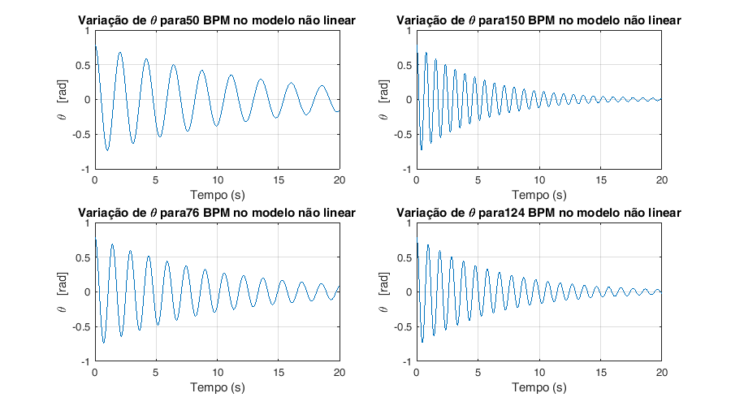

A forma utilizada para refinar o dimensionamento das distancias l,
parecem adequadas, uma vez que, as novas posiçoes da massa m permitem
obter valores para as cadencias proximos dos valores desejados.

## Questão 11{#35}

Simulação de um mecanismo de relojoaria no metrónomo que impulsiona o
pêndulo quando este passa na vertical de modo a contrariar o decaimento
para zero da amplitude das oscilações.

```{.codeinput}
open_system('Q11');
```


Neste diagrama realiza-se a deteção das passagens por zero do ângulo
teta e aplica um impulso positivo na entrada nas transições
negativo-\>positivo.

```{.codeinput}
aux=1;
for l= ls_opt
    cte3 = m*g*l + M*g*L/2;
    cte4 = 1/(((M*(L^2))/3 + m*(l^2)));
    sim('Q11', 20);
    figure (n)
    fig = figure(n);
    set(fig, 'Position', [0, 0, 900, 500])  % x, y, largura e comprimento da figura
    n = n+1;
    plot(t,teta,t,impulsos);
    xlabel('Tempo (s)');
    ylabel('{\theta}   [rad] | Impulsos T [Nm]')
    title(strcat(' BPM = ', num2str(bpm(aux)),' Variação de {\theta} do sistema dimensionado para l = ',num2str(ls_opt(aux)),' com aplicação de binário externo'));
    grid on;
    % Determinação dos valores dos picos e os seus índices de forma a
    % determinar os instantes em que ocorrem:
    [picos, loc] = findpeaks(teta(:,1));
    t_picos = zeros(1,length(loc));
    % wa_e é um vector em que cada indice guarda a frequencia de oscilação
    % entre dois picos:
    wa_e = zeros(1,length(t_picos)-1);
    % inicialização da variavel que guarda a soma das frequencias de
    % oscilação entre cada par de picos:
    soma_wa = 0;
    % Instantes de tempo em que se encontram os picos:
    for i = 1:length(t_picos)
        t_picos(i) = t(loc(i));
    end
    % calacular a frequencia em cada intervalo de tempo (t_picos(i+1) - t_picos(i))
    for i = 1:length(wa_e)
        % sabendo que : wa = 2*pi*f = (2*pi)/(tempo):
        wa_e(i) = (2*pi) ./ (t_picos(i+1) - t_picos(i));
        % Somar as frequenciasobtidas em cada intervalo de tempo:
        soma_wa = soma_wa + wa_e(i);
    end
    % Por fim realizar a media das frequencias todas calculadas e
    % determinar a frequencia de oscilação empirica:
    media = soma_wa/length(wa_e);
    disp(strcat('Frequência angular para ', num2str(media),' BPM = ', num2str(bpm(aux)),'rad/s para a distancia l=',num2str(ls_opt(aux)) ));
    aux = aux+1;
end
```

```{.codeoutput}
Frequência angular para3.3305 BPM =50rad/s para a distancia l=0.21552
Frequência angular para8.3049 BPM =150rad/s para a distancia l=0.077586
Frequência angular para4.6012 BPM =76rad/s para a distancia l=0.17414
Frequência angular para6.988 BPM =124rad/s para a distancia l=0.11207
```

   

Os valores das frequências de oscilação nas condições dimensionadas
sofrem um pequeno aumento na presença do mecanismo de relojoaria. O que
permite concluir que a presença deste mecanismo afecta um pouco a
frequência de oscilação.

# Detecção de Hotspots Wifi

```{.language-matlab}
Autor: Diogo Vilar Sardinha
```

## Contents

<div>

- [Questão 2.a)](#1)
- [Questão 2.b)](#8)
- [Questão 2.c)](#9)
- [Questão 2.d)](#10)

## Questão 2.a){#1}

Decomposição da matriz P trasnposta em valores e vectores próprios.
Obtenção da distribuição de equilíbrio da cadeia de Markov por
normalização de um dos vectores próprios e ilustração da mesma usando o
comando bar.

```{.codeinput}
load('MarkovChain.mat')

Ptrans = transpose(P);
[VecP,ValP] = eig(transpose(P)); % [eigenvectors,eigenvalues] = [VecP,ValP]
% A função eig(Ptrans) calcula os valores próprios da matriz transposta de
% P e coloca-os numa matriz diagonal ValP e coloca na matriz VecP os
% vectores próprios por colunas.

disp(ValP)
```

```{.codeoutput}
  Columns 1 through 7

    1.0000         0         0         0         0         0         0
         0    0.8948         0         0         0         0         0
         0         0    0.9722         0         0         0         0
         0         0         0    0.9509         0         0         0
         0         0         0         0   -0.9621         0         0
         0         0         0         0         0    0.5065         0
         0         0         0         0         0         0    0.4227
         0         0         0         0         0         0         0
         0         0         0         0         0         0         0
         0         0         0         0         0         0         0
         0         0         0         0         0         0         0
         0         0         0         0         0         0         0
         0         0         0         0         0         0         0
         0         0         0         0         0         0         0
         0         0         0         0         0         0         0
         0         0         0         0         0         0         0
         0         0         0         0         0         0         0
         0         0         0         0         0         0         0
         0         0         0         0         0         0         0
         0         0         0         0         0         0         0

  Columns 8 through 14

         0         0         0         0         0         0         0
         0         0         0         0         0         0         0
         0         0         0         0         0         0         0
         0         0         0         0         0         0         0
         0         0         0         0         0         0         0
         0         0         0         0         0         0         0
         0         0         0         0         0         0         0
    0.3156         0         0         0         0         0         0
         0    0.2478         0         0         0         0         0
         0         0   -0.8238         0         0         0         0
         0         0         0   -0.8040         0         0         0
         0         0         0         0   -0.7035         0         0
         0         0         0         0         0    0.0242         0
         0         0         0         0         0         0   -0.0551
         0         0         0         0         0         0         0
         0         0         0         0         0         0         0
         0         0         0         0         0         0         0
         0         0         0         0         0         0         0
         0         0         0         0         0         0         0
         0         0         0         0         0         0         0

  Columns 15 through 20

         0         0         0         0         0         0
         0         0         0         0         0         0
         0         0         0         0         0         0
         0         0         0         0         0         0
         0         0         0         0         0         0
         0         0         0         0         0         0
         0         0         0         0         0         0
         0         0         0         0         0         0
         0         0         0         0         0         0
         0         0         0         0         0         0
         0         0         0         0         0         0
         0         0         0         0         0         0
         0         0         0         0         0         0
         0         0         0         0         0         0
   -0.5140         0         0         0         0         0
         0   -0.2834         0         0         0         0
         0         0   -0.3508         0         0         0
         0         0         0   -0.4380         0         0
         0         0         0         0   -0.4000         0
         0         0         0         0         0   -0.0000
```

De acordo com a matriz diagonal de valores próprios ValP, há uma entrada
nesta matriz cujo valor é 1.

A cadeia de Markov evolui para uma distribuição de equilíbrio
estacionária dada pelo vector próprio associado ao valor próprio 1:

```{.codeinput}
disp(VecP(:,1))
```

```{.codeoutput}
    0.2326
    0.1904
    0.1058
    0.3174
    0.1861
    0.2326
    0.3808
    0.0423
    0.0705
    0.0705
    0.1861
    0.0529
    0.3174
    0.2294
    0.1861
    0.2034
    0.0423
    0.2164
    0.3808
    0.3029
```

Normalização do vector próprio que contem a distribuição de equilíbrio:

```{.codeinput}
Deq = VecP(:,1)/sum(VecP(:,1));

disp('Distribuição de Equilíbrio da cadeia de Markov:');
disp(' ')
for i = 1:length(Deq)
    disp(strcat('Estado ', num2str(i),' -> ', num2str(Deq(i))));
end
[M,I] = min(Deq);
disp(' ')
disp(strcat('Estado menos provável: Estado ', num2str(I)));
[M,I] = max(Deq);
disp(strcat('Estado mais provável: Estado ', num2str(I)));
```

```{.codeoutput}
Distribuição de Equilíbrio da cadeia de Markov:
 
Estado1 ->0.058938
Estado2 ->0.048247
Estado3 ->0.026804
Estado4 ->0.080411
Estado5 ->0.04715
Estado6 ->0.058938
Estado7 ->0.096493
Estado8 ->0.010721
Estado9 ->0.017869
Estado10 ->0.017869
Estado11 ->0.04715
Estado12 ->0.013402
Estado13 ->0.080411
Estado14 ->0.058115
Estado15 ->0.04715
Estado16 ->0.051536
Estado17 ->0.010721
Estado18 ->0.054826
Estado19 ->0.096493
Estado20 ->0.076756
 
Estado menos provável: Estado17
Estado mais provável: Estado7
```

Distribuição de Equilíbrio da cadeia de Markov:

```{.codeinput}
count=1;
figure(count)
count=count+1;
bar(Deq,0.4)
xlabel('Número de cada agente');
ylabel('Probabilidade de equilíbrio')
title(strcat('Distribuição de Equilíbrio da cadeia de Markov'));
grid on
```


Grafo de comunicação entre agentes:

```{.codeinput}
MarkovChainDraw(count)
count=count+1;
```


Observando a Distribuiçao de Equilíbrio Estacionária da Cadeia de
Markov, concluímos, que os estados variam em probabilidade de equilíbrio
consoate o número de ramos de ligação e a probabilidade de transição
associada a cada ramo.

Á medida que nos aproximamos de uma situação esatcionária o agente que
estará na posse do token corresponderá ao estado com probabilidade de
equílibrio mais elevada.

## Questão 2.b){#8}

Geração de observações de RSS para a localização da fonte fornecida com
P0=100, sigma\^2=10\^-2 e ni\~N(0,sigma\^2).

Tendo como base o código fornecido no ficheiro rssiloc.m e fazendo
algumas alterações temos o seguinte código:

```{.codeinput}
figure(count)
count=count+1;
% Simulation setup
N = 20;                 % No. of anchors
n = 2;                  % Embedding dimension
sidelength = 100;
aux1 = transpose(nodePos);
aux2=[aux1(2,:);aux1(3,:)];
a = aux2;       % Anchor positions
x = sourcePos';     % Source position

M=1000; % Número de observações
as=zeros(2,M);
as_aux=zeros(2,M);
for count2=1:length(Deq')
    for i = 1:round(Deq(count2)*M)
        as_aux(:,i)=a(:,count2);
    end
    if count2==1
       as=as_aux;
    end
    if count2>1
       as=[as,as_aux];
    end
    if count2<length(Deq'),
       clear as_aux
    end
end

D = squareform(pdist([x zeros(size(x)) as]'));
d = D(1,3:end);             % Source-anchor distances
an = D(2,3:end);            % Anchor norms

% Generate observations
P0 = 100;               % Source power
P_2 = P0./(d.^2);               % Noiseless RSSI

stdev = 20e-2;              % Log-noise standard deviation
%stdev = 0;
P_2 = P_2.*exp(stdev*randn(size(P_2))); % Introduce noise
QP = 1e-2;
P_2 = QP*round(P_2/QP);         % Quantize power measurements

% Localize source by least-squares
A = [-2*repmat(P_2,[n 1]).*as; -ones(size(P_2)); P_2]';
b = (-P_2.*(an.^2))';

z = A\b;
xe = z(1:n);
aux=norm(x-xe);
disp(strcat('Erro:', num2str(aux)));

if n==2,
  plot(a'*[1; 1i],'o'); hold all
  plot(x'*[1; 1i],'rh'); plot(xe'*[1; 1i],'x'); hold off
  title('Posição dos agentes(o), da fonte exacta(rh) e estimada(x)');
end
```

```{.codeoutput}
Erro:5.0814
```


## Questão 2.c){#9}

Evolução das probabilidades dos diversos estados da cadeia de Markov ao
longo do tempo para diferentes condições iniciais pi(0).

```{.codeinput}
% Tempo de simulação:
N=120;

%Vector do Tempo:
tempo = 1:N;

% Condições iniciais a testar:
f_pi_ini = [0 1 0 0 0 0 0 0 0 0 0 0 0 0 0 0 0 0 0 0; 0 0 0 0 0 0 0 0 0 0 0 0 0 0 0 0 0 0 0.5 0.5; 0 0 0 0 0 0 1 0 0 0 0 0 0 0 0 0 0 0 0 0];
% 1.ª Linha - Token está no agente 2;
% 2.ª Linha - Igual probabilidade de o token estar no no agente 19 ou 20;
% 3.ª Linha - Token está no agente 7.

for ini=1:3
    clear f_pi;
    % Criação da matriz pi(t):
    f_pi = f_pi_ini(ini,:);
    for t=2:N
        aux_pi = f_pi_ini(ini,:)*(P^(t-1));
        if sum(aux_pi) ~= 1
        % Se para este instante do tempo, a soma das probabilidades dos
        % diferentes estados for diferente de 1...
            aux_pi = aux_pi/sum(aux_pi);
        end

        f_pi=[f_pi; aux_pi];
    end

    % Impressão de pi(t), para cada estado em função do tempo:
    figure(count)
    for j=1:20
        estado=ones(1,N)*j;
        plot3(tempo,estado,f_pi(:,j));
        xlabel('Tempo')
        ylabel('N.º do Agente (Estado)')
        zlabel('pi(tempo)')
        title(['Evolução temporal das probabilidades dos diversos estados para f_pi_ini {\ini}=',num2str(ini)])
        hold on;
    end
    count=count+1;
end

% Verificamos que a partir de um certo tempo a função pi(t) estabiliza, ou
% seja, as probabilidades de cada estado deixam de variar com a passagem do
% tempo.

% Diferentes condições iniciais afectam bastante a evolução temporal das
% probabilidades dos diferentes estados durante os primeiros instantes da
% simulação. Mas independentemente das condições iniciais escolhidas,
% quando a função pi(t) estabiliza, esta tende para os valores da
% distribuição de equilíbrio da cadeia de markov anteriormente calculada.
```

  

## Questão 2.d){#10}

Dividimos os estados da cadeia em 4 subconjuntos: A -\> 6-11-16 B -\>
1-7-14-16-18-20 C -\> 2-4-13-19 D -\> 8-9-10-12-17

```{.codeinput}
% Para dificultar a circulação do token, consideramos as
% seguintes alterações na matriz P de modo a que o token fique
% "aprisionado" no subconjunto D:
P(3,19)=0.05;
P(3,12)=0.95;

% Imprimimos de novo a nova distribuição de equilíbrio da cadeia de Markov:
[VecP,ValP] = eig(transpose(P));
Deq = VecP(:,1)/sum(VecP(:,1));

figure(count)
count=count+1;
bar(Deq,0.4)
xlabel('Número de cada agente');
ylabel('Probabilidade de equilíbrio')
title(strcat('Distribuição de Equilíbrio da cadeia de Markov com pior circulação'));
grid on

% Como podemos verificar, os estados com maior probabilidade são sobretudo
% os do subconjunto D que era o pretendido.

% Para melhorar a eficácia de circulação global do token, consideramos as
% seguintes alterações na matriz P:

% Melhoramento na comunicação entre A e B:
P(6,1)=0.5;
P(6,11)=0.25;
P(6,15)=0.25;

P(1,6)=0.5;
P(1,7)=0.25;
P(1,20)=0.25;

% Melhoramento na comunicação entre B e C:
P(7,1)=0.2;
P(7,16)=0.1;
P(7,19)=0.5;
P(7,20)=0.2;

P(19,3)=0.4; % Esta alteração também melhora a comunicação entre C e D.
P(19,4)=0.1;
P(19,7)=0.4;
P(19,13)=0.1;

% Melhoramento na comunicação entre C e D:
P(3,19)=0.65;
P(3,12)=0.35;

P(12,3)=0.5;
P(12,8)=0.25;
P(12,10)=0.25;

% Por fim, imprimimos a nova distribuição de equilíbrio da cadeia de Markov:
[VecP,ValP] = eig(transpose(P));
Deq = VecP(:,1)/sum(VecP(:,1));

figure(count)
count=count+1;
bar(Deq,0.4)
xlabel('Número de cada agente');
ylabel('Probabilidade de equilíbrio')
title(strcat('Distribuição de Equilíbrio da cadeia de Markov com melhor circulação'));
grid on

% Verifica-se uma circulação do token mais equilibrada por todos os
% agentes e uma maior probabilidade de passagem do token pelos
% agentes que ligam diferentes subconjuntos e por isso temos uma melhor
% circulação do token por entre os vários subconjuntos.

% Em suma, quanto menor for a fluidez de o token circular por todos os
% subconjuntos e agentes, menos precisa vai ser a localização da fonte
% obtida e vice-versa. Por outras palavras, quanto mais uniforme for a
% circulação do token por todos os agentes, mais precisão vamos ter na
% deteccção da fonte.
```

 

